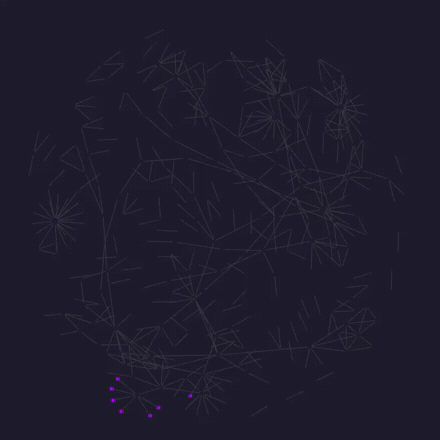
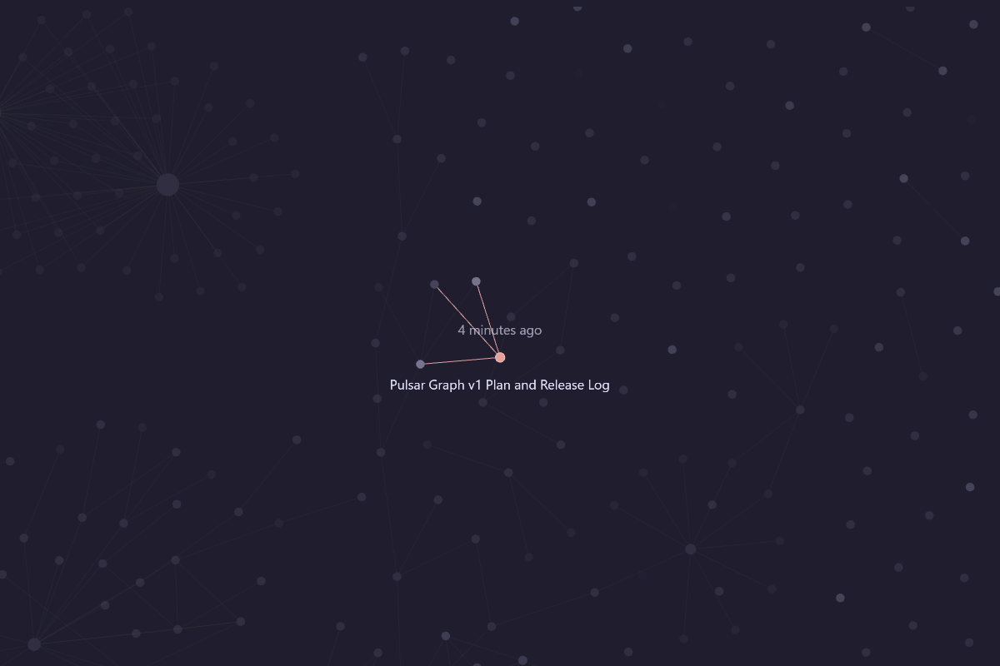

# Pulsar

Fades the nodes in Obsidian's graph by how recently you touched each note, so the
part of your vault you're actually working in lights up and the rest sinks back.

<p align="center">
  <a href="https://github.com/Lucas-Liona/obsidian-pulsar-graph/actions/workflows/ci.yml"></a>
  <a href="LICENSE"></a>
  
  
</p>

<p align="center">
  
</p>

<p align="center"><i>My own vault, 1200 notes. Every bright dot is something I touched this week.</i></p>

<p align="center">
  
</p>

<p align="center"><i>The same vault, sweeping the fade from hardest to softest. The newest notes come up first.</i></p>

## Why I made it

I built this plugin a year ago and I've been using it since, and I wanted to share
it with people.

When you have a vault this big, you forget things you used to write. Graph mode
equalizes everything — a note from two years ago sits there looking exactly like
the one you wrote this morning. At first it's intimidating, and then it's just
flat. I wanted the graph to carry time in it, so I could see what I've been
working on without reading a single label, and so the old stuff would actually
look old.

That turned out to be the useful part. You find concepts you meant to keep up
with and haven't touched in months — all those learning notes sitting out at the
dim edge. It makes you want to go write them properly, and it pushes you toward
real links and well-defined notes, because that's what makes the clusters show up.

## How I use it

Set Obsidian's **text fade threshold** (Graph view settings → Display) so the
titles only appear once you lean in. Then at rest you're not reading anything —
you're just looking at colour, and you can feel what's new and what's gone quiet.
Zoom in a little and the names fade up right where you're looking.

It does the same thing for the local graph. When you're in a note and you can see
which of its neighbours are alive and which have been sitting there for a year,
that's a different kind of context than a list of links.

## What it does

Every note gets a recency value between 0 and 1 — 0 at the old end of the range,
1 at the new one. A fade curve shapes that number, and the result becomes the
node's opacity.

### What counts as old

**Measure age against** decides where those two ends sit, and it matters more than
the curve does.

**The vault's whole history** runs from your oldest note to your newest. It's the
default and it's honest, but one note from years ago sets the far end for
everything else, and then a year of recent work can land inside a few percent of
the range and come out looking identical. On my own vault — 1060 notes, default
curve — that puts **1001 of them in the top fifth of the range**.

**A recent window** throws the old end away and spends the whole range on the last
so many days. Anything older sits at minimum opacity. Same vault, same curve, a
30 day window: 850 notes drop to the bottom and the remaining 210 spread out
properly across the rest.

Which you want depends on what you're looking at. The whole history is a picture
of the vault; a window is a picture of what you're working on. The window is also
the one that keeps meaning something when you come back after a month away,
because it's anchored to the clock rather than to your newest note.

### How ages turn into gaps

**Age scale** decides what a gap between two notes is worth.

| Scale | What it does | Good for |
| --- | --- | --- |
| Even | Opacity follows the calendar | A vault edited at a steady rate |
| By rank | A note's place in the running order, not its date | Any vault — a lopsided history can't flatten it |
| Logarithmic | Recent gaps count for more, old ones for less | Picking the last few days out of a long history |

**By rank** is the one that can't be defeated by your editing history. Half your
notes are above the halfway mark by construction, whatever the dates look like.
Here's the same 1060 note vault with the default curve, counting notes in each
fifth of the opacity range:

| | | | | | |
| --- | ---: | ---: | ---: | ---: | ---: |
| Whole history, even | 17 | 12 | 22 | 8 | **1001** |
| Whole history, by rank | 118 | 235 | 236 | 235 | 236 |
| 30 day window, even | 850 | 23 | 88 | 47 | 52 |
| 30 day window, by rank | 866 | 48 | 49 | 48 | 49 |

The trade is that rank hides *how much* older something is. Two notes a year
apart look as different as two notes a day apart, if nothing else sits between
them. Even and logarithmic keep that information; rank spends it on contrast.

### Fade curves

| Curve | What it does | Good for |
| --- | --- | --- |
| Linear | Opacity tracks recency evenly | An even spread across the vault's history |
| Exponential | `recency ^ steepness` | Picking out very recent work. Steepness above 1 is sharper, below 1 gentler |
| Step | Recency rounded onto evenly spaced levels | Reading the graph as distinct bands of age |

### Settings

Every slider has a number box beside it, and a preview at the top of the settings
shows dots at real ages from your own vault at the opacity each would get, so you
can see what a change does before you close the dialog.

At the bottom, **What this is doing to your vault** shows the numbers behind all
of it: how your notes are spread across the brightness range, how many distinct
brightnesses exist, how your folders divide up, how many islands of linked notes
the open graph has and how big the largest is, and how many links join notes
written in the same sitting.

Every design decision in this plugin was settled by measuring rather than
arguing, and the measurements kept turning out to say more about the vault than
about the plugin. There's no reason to keep that to whoever's holding a debugger.

If you'd rather not assemble a combination yourself, there are presets at the
bottom, next to **Reset**:

| Preset | What you get |
| --- | --- |
| Gentle | Everything stays readable. Age is a hint rather than a filter |
| Even spread | Ranked against each other, so the graph has full contrast whatever your history looks like |
| Bands of age | Five distinct steps, so the graph reads as layers rather than a gradient |
| This month | The last 30 days get the whole range; everything older drops away |
| This week | Seven days on a log scale, so today separates sharply from Tuesday |

A preset only moves the settings that shape the fade. What you've chosen to
*show* — the age labels, the status bar, your spotlight colour — is left alone.

| Setting | Range | Default | Applies to |
| --- | --- | --- | --- |
| Measure age against | Whole history, Recent window | Whole history | all |
| Window | 1 – 365 days | 30 | Recent window |
| Age scale | Even, By rank, Logarithmic | Even | all |
| Fade type | Linear, Exponential, Step | Linear | all |
| Minimum opacity | 0.0 – 1.0 | 0.1 | all |
| Maximum opacity | 0.0 – 12.0 | 3.0 | all |
| Steepness | 0.1 – 10.0 | 2.0 | Exponential |
| Number of steps | 1 – 20 | 5 | Step |
| Show note age | Never, On hover, With titles | On hover | all |
| Age the links too | Off, Match the newer note, Fade between the two | Off | all |
| Group temperature | 0.0 - 1.0 | 0 (off) | all |
| Group notes by | Folder, Linked island | Folder | Temperature above 0 |
| Trace what was written together | on / off | off | all |
| Counts as one sitting | 1 - 240 minutes | 30 | Tracing on |
| Trail colour | any | blue | Tracing on |
| Trail strength | 0.0 - 1.0 | 0.55 | Tracing on |
| Neighbour glow | 0.0 - 0.95 | 0 (off) | all |
| Glow reach | 1 - 3 hops | 1 | Glow above 0 |
| Age in the status bar | on / off | off | all |
| Spotlight the newest note | on / off | off | all |
| Spotlight colour | any | white | Spotlight on |
| Spotlight strength | 0.0 – 1.0 | 1.0 | Spotlight on |

Maximum opacity goes above 1.0 on purpose. Obsidian multiplies a node's opacity by
its own fade factor, so pushing past 1.0 keeps your recent notes at full strength
while everything older still falls away. Be aware that it is clamped at 1.0 when
drawn, so a very high maximum flattens the top of the curve — the preview shows
you when that is happening. The two opacity sliders can't cross — move one past
the other and it takes the other with it.

### Hover and spotlight

A note's age — "3 days ago", "5 months ago" — is drawn above its node, centred,
the same distance up as the title sits down, in the same font and a little
quieter. It's part of the graph, not a tooltip over it, so it pans and zooms with
everything else. Obsidian's own page preview still works alongside it.

<p align="center">
  
</p>

**Show note age** has three settings:

| | |
|---|---|
| **Never** | No ages at all. |
| **On hover** | The age appears above whichever node you're pointing at. The default. |
| **Whenever titles are shown** | Every node that's showing its name shows its age too, dimmed by that note's own opacity. |

That last one is worth a try if you already use the text fade threshold the way I
do: the names come in as you lean towards the graph, and now the dates come with
them, with old notes carrying faint ones.

### Group temperature

**Group temperature** pulls every note toward the middle of the group it belongs
to, so a part of the vault reads as alive or as cold at a glance instead of
having to be picked out note by note. Unlike the glow below, it moves notes
**both ways**: a stale note in a busy folder comes up, a fresh one in an
abandoned corner goes down.

Group by folder or by island of linked notes. Folders suit most vaults — mine
splits into regions that genuinely differ:

| Folder | Notes | Mean brightness |
| --- | ---: | ---: |
| 2 Areas | 177 | 0.75 |
| _Journal | 387 | 0.17 |
| 3 Notes | 78 | 0.17 |
| 4 Reference | 81 | 0.14 |
| 5 Archive | 206 | 0.11 |

Islands of linked notes only work if your vault actually has islands. Mine has
686 of them, and 633 are single notes with one blob of 421 in the middle, so
folders tell me far more. Check yours before reaching for it.

Off by default.

### Neighbour glow

A note doesn't live alone. **Neighbour glow** lets a bright note lift the notes
it links to, so an area you're working in reads as a region rather than as
scattered points. Each node takes the better of its own brightness and a fraction
of its brightest neighbour, and **Glow reach** decides how many links that
travels along — each step carries the fraction again, so it falls away with
distance.

Worth knowing: the glow travels along links, and grouping by *island of linked
notes* draws its boundaries along those same links. The glow runs first for
exactly that reason — warming first would hand every node neighbours identical to
itself and leave the glow nothing to lift.

How much it does for you depends on how linked your vault is. Mine is sparse —
about 700 links across 1060 notes — so the effect is real but gentle. A densely
linked vault will see much more.

Off by default.

### Links carry age too

Obsidian draws every link in one flat colour whatever its two ends have been
through, which leaves the busiest half of the picture saying nothing about time.
**Age the links too** changes that:

- **Match the newer note** gives a link the age of its livelier end, so the
  structure around recent work comes forward instead of sitting in uniform grey.
- **Fade between the two** fades each link along its length, bright at the newer
  note and dim at the older one.

That second one is worth it for the discovery thing: a bright line running out of
today's work and dimming into something you wrote a year ago is exactly the note
you'd forgotten you had. Off by default, like everything that changes how the
graph is drawn beyond the nodes themselves.

### What you wrote together

**Trace what was written together** colours the link between two notes that were
saved close enough together to have been open in the same sitting. It says
nothing about *how long ago* — the fade already does that — so the two read as
separate facts: colour for togetherness, brightness for age.

How much it catches depends on how you work. On my vault a 5 minute window
already marks 246 of 692 links, and stretching it to 4 hours only reaches 312,
which says most of my linked notes were written in genuine bursts rather than
drifting together over an afternoon.

Off by default, with its own colour kept clear of the spotlight's. **Trail
strength** mixes that colour with the one links are normally drawn in — at full
strength it is a stripe of neon, and a little under half way reads as a warmer
line, which is much easier to sit with.

There's also a status bar item — **Edited 4 minutes ago** for whatever note you
have open. It reads the note, not the graph, so it works with no graph view in
sight. Off by default, since it puts something in a part of Obsidian the plugin
doesn't otherwise touch.

The spotlight paints the single most recently modified note a colour of your
own, so the thing you touched last is findable at a glance. It's off by default,
because it's the one feature here that changes a node's colour rather than its
opacity, and it puts the original colour back the moment the newest note changes,
you turn it off, or the plugin unloads.

**Spotlight strength** decides how far that colour overrides the node's own. At
full strength you get exactly the colour you picked. Below that it mixes with
whatever your graph groups gave the node, which is the only way a group colour
should ever end up in there.

## Worth knowing

- **Only notes are faded.** Attachments and unresolved links keep whatever colour
  the graph gives them. Their timestamps don't say anything about when you were
  actually working on something.
- **Your group colours survive.** The plugin changes how transparent a node is and
  leaves its colour alone, so anything you've set up with graph groups still works.
  The one exception is the newest-note spotlight, which is off unless you turn it
  on and restores the colour it replaced.
- **A faded node is still there.** Obsidian draws labels, links and physics with
  their own opacity, so a note at minimum opacity still has a visible title and
  stays clickable. This is a fade, not a filter — that's
  [a separate idea](https://github.com/Lucas-Liona/obsidian-pulsar-graph/issues/23).
  Turning the text fade threshold up is the fix today, and it's the better way to
  use it anyway.
- **Nothing runs on a timer.** Opacity is reapplied when a note changes, when a
  graph rebuilds, and when you change a setting. While the vault is idle the plugin
  does nothing at all.

## Install

Pulsar isn't in the community directory yet. Until it is:

1. Download `main.js`, `manifest.json` and `styles.css` from the
   [latest release](https://github.com/Lucas-Liona/obsidian-pulsar-graph/releases).
2. Put all three in `YourVault/.obsidian/plugins/pulsar-graph/`. The folder and
   the plugin id stay `pulsar-graph`; only the name is shorter.
3. Reload Obsidian and turn it on under **Community plugins**.

## Compatibility

Obsidian 1.8.0 or newer, desktop and mobile, global and local graph views.

The plugin reaches into Obsidian's graph renderer, which isn't part of the public
API. It's written to quietly do nothing rather than break if those internals
change, but a graph update can still mean it needs a fix here.

## Where it's going

I made this to do one thing well, and I'd rather keep it that way than bolt on
everything. That said, time is a bigger idea than opacity, and the direction I'm
interested in is making time easier to see throughout the graph: a note's age on
hover, a spotlight on whatever you edited last, a preview of the curve while
you're setting it, and anchoring opacity to real dates instead of to your vault's
own range. Further out, playing nicely with other ways of exploring a graph.

It's all in the [issues](https://github.com/Lucas-Liona/obsidian-pulsar-graph/issues)
and grouped into [milestones](https://github.com/Lucas-Liona/obsidian-pulsar-graph/milestones).
If you use this and something is missing, open one.

## Development

```bash
git clone https://github.com/Lucas-Liona/obsidian-pulsar-graph.git
cd obsidian-pulsar-graph
npm install
npm run dev     # watch build
npm run build   # production build, type-check included
npm run lint
```

`main.js` is built, not committed. To try a build, copy it next to `manifest.json`
in a vault's plugin folder and reload the plugin.
[AGENTS.md](AGENTS.md) has the repo conventions and the release process.

## Credits

Written by me. The 1.0 cleanup — splitting it into modules, the build and release
setup, and a pile of bug fixes — I did with Claude, in my free time, to get the
repo into shape so other people could actually use it.

## License

[MIT](LICENSE)
