# Pulsar

<p align="center">
  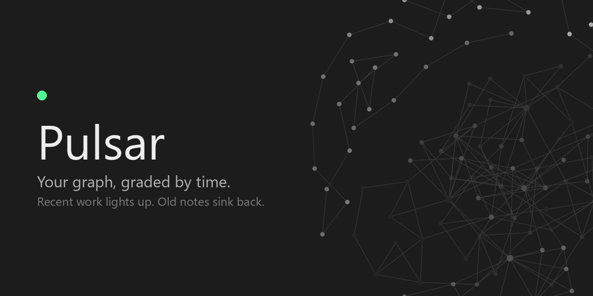
</p>

Fades the nodes in Obsidian's graph by how recently you touched each note, so the
part of your vault you're actually working in lights up and the rest sinks back.

<p align="center">
  <a href="https://github.com/Lucas-Liona/obsidian-pulsar-graph/actions/workflows/ci.yml"></a>
  <a href="LICENSE"></a>
  
  
</p>

<p align="center">
  
</p>

<p align="center"><i>My own vault, 1200 notes. Every bright dot is something I touched this week.</i></p>

<p align="center">
  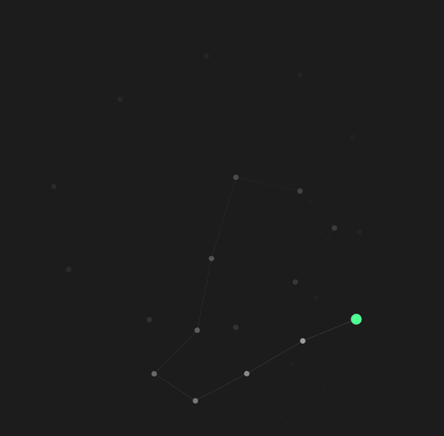
</p>

<p align="center"><i>Sweeping the fade from hardest to softest. The green dot is the note I touched last.</i></p>

<p align="center">
  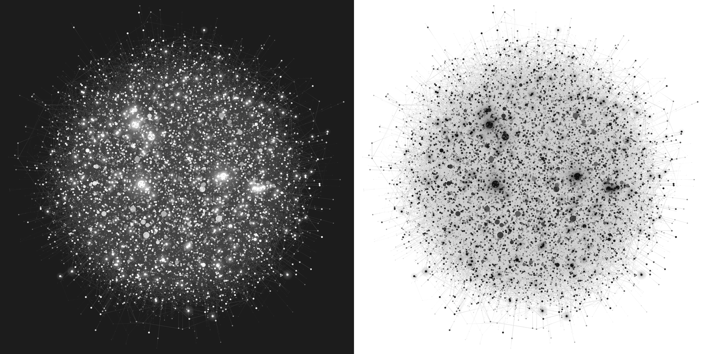
</p>

<p align="center"><i>20,000 notes with stars on: the 250 newest glow, and on a light theme they're black holes.</i></p>

## Why I made it

I built this plugin a year ago and I've been using it since, and I wanted to share
it with people.

When you have a vault this big, you forget things you used to write. Graph mode
equalizes everything — a note from two years ago sits there looking exactly like
the one you wrote this morning. At first it's intimidating, and then it's just
flat. I wanted the graph to carry time in it, so I could see what I've been
working on without reading a single label, and so the old stuff would actually
look old.

That turned out to be the useful part. You find concepts you meant to keep up
with and haven't touched in months — all those learning notes sitting out at the
dim edge. It makes you want to go write them properly, and it pushes you toward
real links and well-defined notes, because that's what makes the clusters show up.

## How I use it

Set Obsidian's **text fade threshold** (Graph view settings → Display) so the
titles only appear once you lean in. Then at rest you're not reading anything —
you're just looking at colour, and you can feel what's new and what's gone quiet.
Zoom in a little and the names fade up right where you're looking.

It does the same thing for the local graph. When you're in a note and you can see
which of its neighbours are alive and which have been sitting there for a year,
that's a different kind of context than a list of links.

## What it does

Every note gets a recency value between 0 and 1 — 0 at the old end of the range,
1 at the new one. A fade curve shapes that number, and the result becomes the
node's opacity.

## Documentation

Every surface has a page. Start wherever you are curious; nothing here depends on
being read in order.

<table>
  <tr>
    <td width="50%" valign="top">
      <a href="docs/time.md">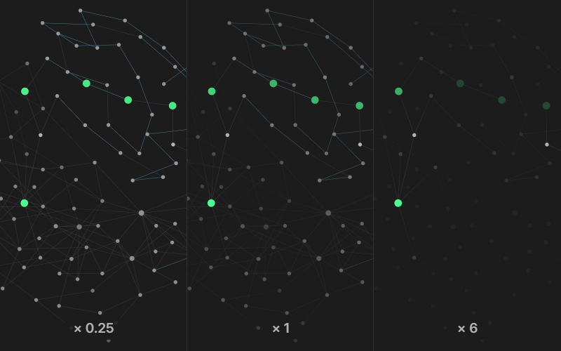</a><br>
      <b><a href="docs/time.md">Time</a></b><br>
      What counts as old, and how an age becomes a brightness. The number everything else reads.
    </td>
    <td width="50%" valign="top">
      <a href="docs/graph.md">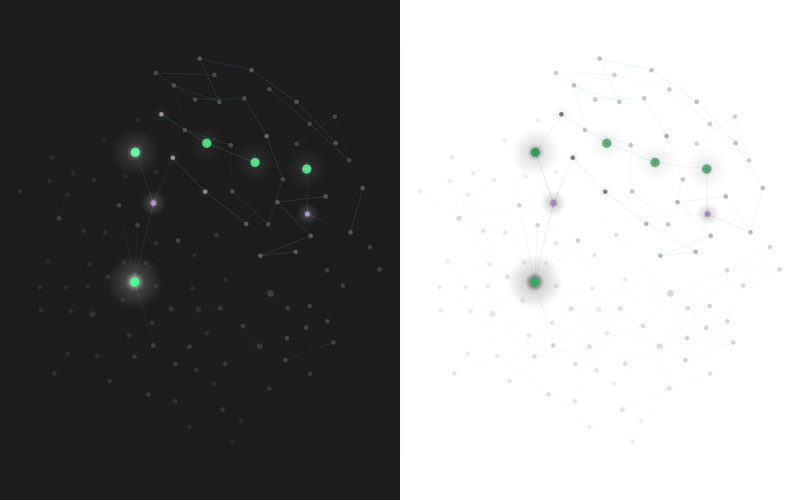</a><br>
      <b><a href="docs/graph.md">The graph</a></b><br>
      Stars around the newest notes, size by age, the age above a node, the spotlight, the glow between neighbours, and what links carry.
    </td>
  </tr>
  <tr>
    <td width="50%" valign="top">
      <a href="docs/filter.md">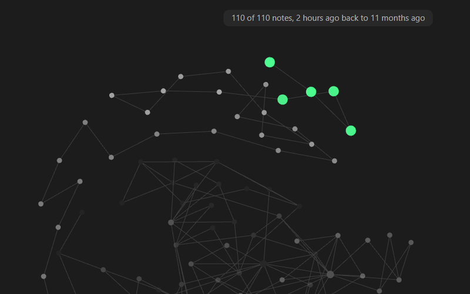</a><br>
      <b><a href="docs/filter.md">The age filter</a></b><br>
      Taking notes out of the graph rather than dimming them, with a scrubber in the graph's own panel.
    </td>
    <td width="50%" valign="top">
      <a href="docs/local-graph.md">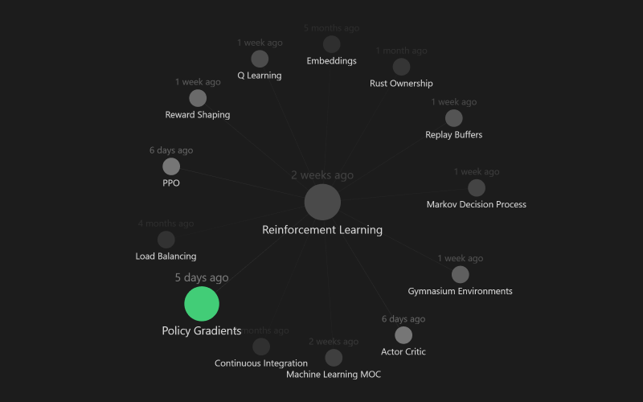</a><br>
      <b><a href="docs/local-graph.md">The local graph</a></b><br>
      The panel around one note, measured against its own notes, or from the note in the middle.
    </td>
  </tr>
  <tr>
    <td width="50%" valign="top">
      <a href="docs/pins.md">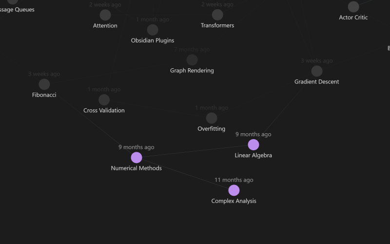</a><br>
      <b><a href="docs/pins.md">Pins</a></b><br>
      Notes you hold bright whatever their dates say. The one place you overrule the clock.
    </td>
    <td width="50%" valign="top">
      <a href="docs/tabs.md">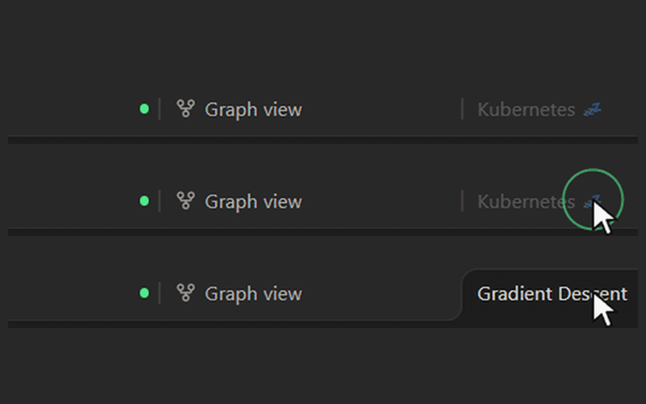</a><br>
      <b><a href="docs/tabs.md">Tabs</a></b><br>
      The tab bar as a readout of attention: tabs fade by how long since you looked, and the ones you have left alone sleep.
    </td>
  </tr>
  <tr>
    <td width="50%" valign="top">
      <a href="docs/writing.md">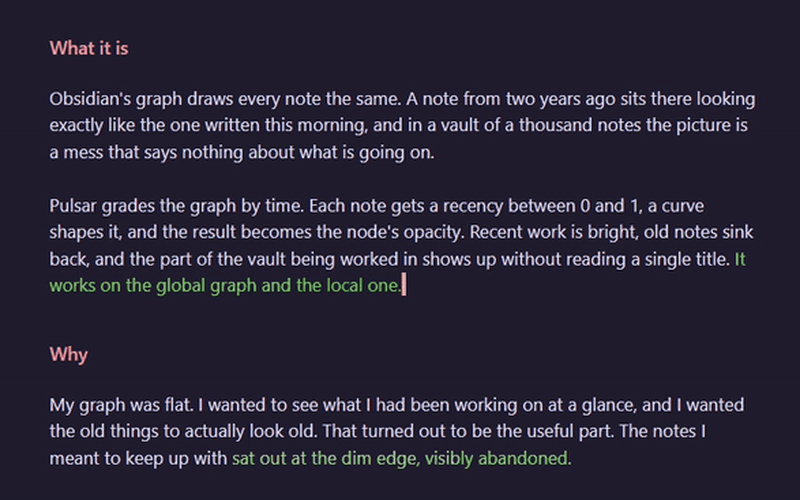</a><br>
      <b><a href="docs/writing.md">Fresh writing</a></b><br>
      Text takes a colour as you type it and cools back to normal.
    </td>
    <td width="50%" valign="top">
      <a href="docs/beads.md">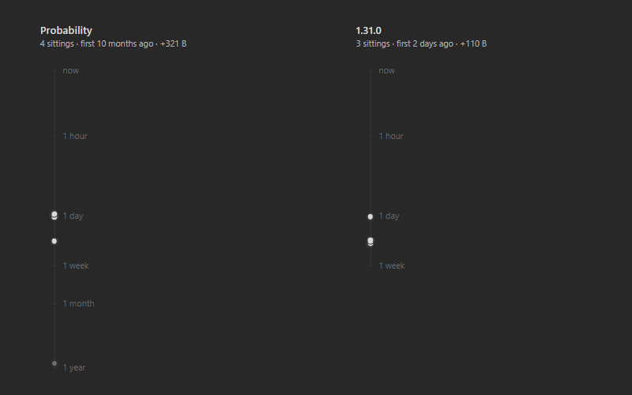</a><br>
      <b><a href="docs/beads.md">A note's history</a></b><br>
      Each sitting on a note as a bead down the sidebar, from Pulsar's own <a href="docs/history.md">edit history</a>.
    </td>
  </tr>
  <tr>
    <td width="50%" valign="top">
      <a href="docs/performance.md"><picture>
        <source media="(prefers-color-scheme: dark)" srcset="docs/assets/perf/scale-dark.svg">
        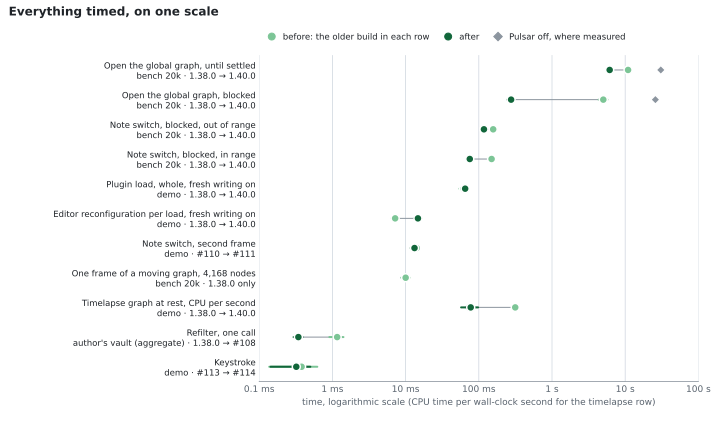
      </picture></a><br>
      <b><a href="docs/performance.md">Performance</a></b><br>
      What Pulsar costs at 20,000 notes, where the time goes, and how it was measured.
    </td>
    <td width="50%" valign="top">
      <b><a href="docs/settings.md">Every setting</a></b><br>
      The reference table, with every default and what each one applies to.
      <br><br>
      <b><a href="docs/README.md">All the docs</a></b><br>
      The same pages, and where every picture here came from.
    </td>
  </tr>
</table>

## Switching it off

One toggle at the top of the settings, above everything else, and off means off:
no events watched, no caches built, no timers running, no editor carrying
anything of ours, no status bar item, and every graph handed back its own
colours. The settings page collapses to that one switch.

Every feature below it can also be switched off on its own. A new install
starts with most of them on, so the first look shows what Pulsar does. The ones
that would hide notes or change what a brightness means start off: the age
filter, group temperature, and the blend with how much each note was edited.

## Worth knowing

- **Node names keep up with node size.** Obsidian sizes a title from its node
  but only rebuilds the text when something flags the node dirty, and moving the
  graph's node size slider doesn't. So the circles grow and the names stay put.
  Pulsar flags them, because it draws text beside those names at the same size
  and can't very well leave them behind.
- **Only notes are faded.** Attachments and unresolved links keep whatever colour
  the graph gives them. Their timestamps don't say anything about when you were
  actually working on something.
- **Your group colours survive.** The plugin changes how transparent a node is and
  leaves its colour alone, so anything you've set up with graph groups still works.
  Two things paint a node — the spotlight and a pin — and both hand the colour
  back when they move on. The spotlight marks the newest note from the start; a
  pin paints nothing until you pin something.
- **A faded node is still there.** Obsidian draws labels, links and physics with
  their own opacity, so a note at minimum opacity still has a visible title and
  stays clickable. To take notes out of the graph instead, that's the
  [age filter](docs/filter.md). To quiet the titles, turn up the text fade
  threshold, which is the better way to use it anyway.
- **Opacity isn't polled.** It's reapplied when a note changes, when a graph
  rebuilds, and when you change a setting — never on a timer. The only timers in
  the plugin belong to the features that fade against the clock rather than against
  the vault: the status bar re-reads it once a minute, the tabs twice a minute,
  and fresh writing once per shade — and that last one only runs in an editor
  that still has something left to cool. The one exception is a star's pulse,
  off unless you turn it on: it draws the graph 30 times a second while the
  graph is otherwise still, and stops when the pulse does.
- **It reads timestamps and file sizes, never contents.** How recently a note was
  modified, and how long it is. Fresh writing adds one more of the same kind:
  where in a note an edit landed, and how long it was — never what it said. Not a
  word of what any note says, no network calls
  of any kind, and nothing written anywhere except this plugin's own folder. The
  one place it reads outside the vault is core *File recovery*'s snapshot
  database, and only when you press **Import earlier history** — it takes the
  timestamps and cannot reach the note text those snapshots contain.

## What it costs

<p align="center">
  <picture>
    <source media="(prefers-color-scheme: dark)" srcset="docs/assets/perf/open-20k-dark.svg">
    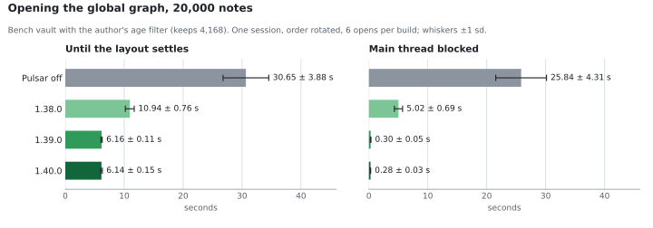
  </picture>
</p>

Measured in a vault of 20,000 generated notes, and in the demo vault:

- **Opening the graph with the age filter on** settles in 6.1 seconds, against
  30.7 for Obsidian on its own, and blocks the window for 0.3 seconds rather
  than 25.8, because Obsidian is handed the 4,168 notes the filter keeps instead
  of all 20,000.
- **Switching notes** at 20,000 notes blocks for 75 ± 6 ms.
- **A graph at rest stays asleep.** In the demo vault, after its timelapse has
  run, the graph's renderer uses 0.078 of a core, against 0.072 with Pulsar off.

Those are 1.40.0's figures. Every run, the machine, the method and what it
gets wrong are on the [performance page](docs/performance.md).

## Install

Pulsar isn't in the community directory yet. Until it is:

1. Download `main.js`, `manifest.json` and `styles.css` from the
   [latest release](https://github.com/Lucas-Liona/obsidian-pulsar-graph/releases).
2. Put all three in `YourVault/.obsidian/plugins/pulsar-graph/`. The folder and
   the plugin id stay `pulsar-graph`; only the name is shorter.
3. Reload Obsidian and turn it on under **Community plugins**.

## Compatibility

Obsidian 1.8.0 or newer, desktop and mobile, global and local graph views.

The plugin reaches into Obsidian's graph renderer, which isn't part of the public
API. It's written to quietly do nothing rather than break if those internals
change, but a graph update can still mean it needs a fix here.

## Where it's going

I made this to do one thing well, and I'd rather keep it that way than bolt on
everything. That said, time is a bigger idea than opacity, and the direction is
making time easier to see throughout the graph.

Most of what used to be listed here is in now: a local graph measured against
its own notes, the graph's timelapse lit as it plays, the age filter, and stars.
What's next is a first look that says what the plugin is doing, and ages in more
of Obsidian: search and the quick switcher, the note itself, and Bases.

It's all in the [issues](https://github.com/Lucas-Liona/obsidian-pulsar-graph/issues).
The ones marked
[help wanted](https://github.com/Lucas-Liona/obsidian-pulsar-graph/labels/help%20wanted)
are open to anyone. If you use this and something is missing, open one.

## Development

```bash
git clone https://github.com/Lucas-Liona/obsidian-pulsar-graph.git
cd obsidian-pulsar-graph
npm install
npm run dev     # watch build
npm run build   # production build, type-check included
npm run lint
```

`main.js` is built, not committed. To try a build, copy it next to `manifest.json`
in a vault's plugin folder and reload the plugin.
[AGENTS.md](AGENTS.md) has the repo conventions and the release process.

## Credits

Written by me. I built the first version on my own, and since 1.0 most of the
code has been written with Claude: the edit history, tabs, fresh writing, the age
filter, stars and the performance work. Every change went in as a pull request
with its measurements in it, and I decided what shipped. All of it in my free
time.

More of what I make is at [lucasliona.tech](https://lucasliona.tech).

## License

[MIT](LICENSE)
