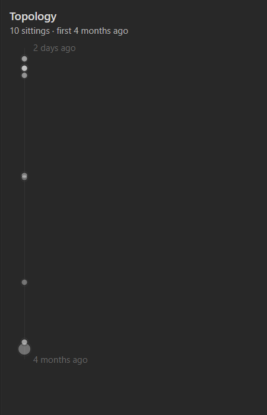

# A note's history

One bead per sitting, down a rail, positioned by when it happened.

  

Obsidian keeps one modification time per note and throws the rest away, so the
graph can tell you a note was touched this morning and never that it was touched
every morning for a month and then abandoned. [Pulsar's own
record](history.md) keeps the rest. This is where you read it.

Open it with the command **Show this note's history**. It lives in the right
sidebar and follows whatever note you are looking at.

## Reading it

**Newest at the top.** Each bead is one *sitting* — a run of writing with no gap
in it longer than your session gap — so a morning's work is one bead rather than
the several hundred autosaves it really was.

**Position is the point.** A list of dates would be easier to draw and answers a
different question; the shape is what tells "edited three times today" from
"appended to once a month" without reading a single number. Beads bunch where you
were busy and leave gaps where you were not, and the gaps say as much as the
beads do.

**The rail is this note's own life**, from its first sitting to its last, with
both ends labelled. Measuring against the vault instead collapses the view: a
note worked on three times this morning, in a vault with a year of history in it,
puts all three beads inside the same pixel. Because the scale is the note's own,
always read the labels — a rail covering twenty minutes looks exactly like one
covering a year.

**Size is how long the sitting ran**, up to two hours. A sitting recorded from a
single write has no duration at all and still draws, at the floor.

**Brightness is the vault's scale**, the same one the graph fades by, so a bead
near the top is as bright as that note's node. It is held clear of the very
bottom: the graph can afford to take a node to nearly nothing because a thousand
others carry the picture, but a bead you cannot see is a bead you cannot hover.

**Hover a bead** for when it was, how long it ran, and how much the note grew or
shrank while you were in it.

## When it is empty

It says which of the three reasons applies:

- **The history is switched off** — or Pulsar is. It is in the settings.
- **No note open.** Nothing to show a history of.
- **Nothing recorded yet** for this note, which is the normal state on day one.
  The record starts empty and is worth little until it has been running a while.
  The settings can [import what Obsidian's own file recovery already
  holds](history.md), which is usually the last week.

---

[← All docs](README.md) · [Pulsar](../README.md)
