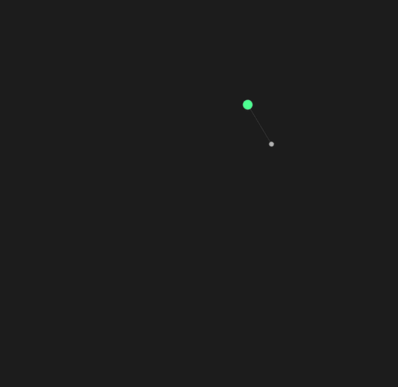
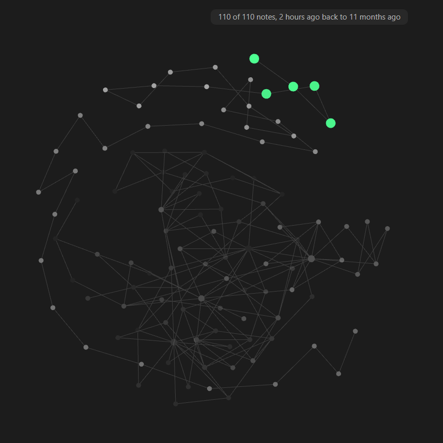

# The age filter

Taking notes out of the graph entirely rather than dimming them, and the
scrubber that does it from inside the graph.

  

Fading a note is not hiding it. Obsidian draws a title, its links and its physics
regardless of how transparent the node is, so a note at minimum opacity is still
sitting there taking up room. **Hide notes outside a range** takes them out of
the graph entirely, and what's left re-packs into a tighter shape.

**Keep** is a line with a handle at each end, drawn over the same spread of your
notes the statistics panel shows, so you can aim it at something real rather than
guessing at a number. You can add more than one range — keep the oldest and the
newest and nothing in between, or just the middle of the herd.

Drag a handle to move one edge. **Drag the lit stretch between them to move the
whole range** without changing how wide it is, which is usually the thing you
want once you have decided how big a slice to look at.

Under the line is what the range is actually catching, in dates rather than in
brightness: *223 of 1088 notes, 46 minutes ago back to 3 weeks ago*. Brightness
is not a quantity anyone has an intuition for, so the only honest way to say what
a position on the line means is to go and look. Nothing is inverted or estimated
— the notes are counted.

**Say so on the graph** puts that same line across the top of the graph itself:

> 110 of 110 notes, 1 hour ago back to 4 months ago

  

It is worth leaving on whether or not you are filtering. While you are, it is
necessary — a graph with half its notes taken out looks exactly like a graph.
While you are not, it still answers the question a graph raises on its own, which
is *what am I looking at*.

Three things it will not do:

- **The note you have open is never hidden.** Otherwise opening an old note would
  make it vanish from the graph, and the local graph would go blank.
- **A [pinned](pins.md) note is never hidden.** The note you pinned is old — that
  is why it needed pinning — so it is exactly what this would otherwise take out
  first, and a pin that vanishes when you narrow the range is not a pin.
- **Attachments and unresolved links are never hidden.** The filter asks how old
  a note is, and those have no age to answer with.

It reads each note's *own* brightness, not the brightness it ends up drawn at. A
note shouldn't count as recent because something next to it is.

The same control lives in the graph's own panel, under **Age**, beside Filters,
Groups, Display and Forces. Filtering by time is a view rather than a preference
— you reach for it to look at something and then put it back — so it belongs
where you already are instead of behind a settings dialog. It's the same setting
in both places; moving one moves the other.

## Reading the bar

The shape behind the handles is your vault counted into columns — where the
notes actually sit on the brightness range, so a handle has something real to
aim at. It's drawn at **one column every three pixels** of however wide the bar
happens to be: a 190-pixel panel gets 63 columns, the settings dialog gets a few
hundred. At that resolution bars are noise, so it's drawn as an area instead.
The small number in the corner is how many notes are in the tallest column —
the one thing a shape can't tell you.

**Hover a column** and the line underneath says what is in that column alone,
in the same words it uses for a selection. The shape answers *where are the
notes*; the question people actually arrive with is *what is that bump*.

The line also carries the share: `194 of 1092 notes (18%)`. A ratio nobody
computes mid-drag, and the percentage is what the handle is really choosing.

**A press goes to the nearest handle**, not to whatever the browser decides is
under the cursor. At the narrowest a range is allowed to be, the two handles sit
**four pixels apart** — their grab areas overlap however they are sized, and an
overlap is settled by document order, so the handle you aimed at loses to the
one drawn after it, reliably and invisibly. Distance is what you meant, so
distance decides. It also means a press *near* a handle catches it, which is
what lets the handles stay thin enough to sit beside each other at all.

**Dragging a handle doesn't rebuild the graph.** While you hold it, notes are
only hidden: every position stays exactly where it was, so the thing you're
aiming at holds still instead of crawling away from the cursor. The real filter,
with the re-pack, happens when you let go.

Off by default.

---

[← All docs](README.md) · [Pulsar](../README.md)
