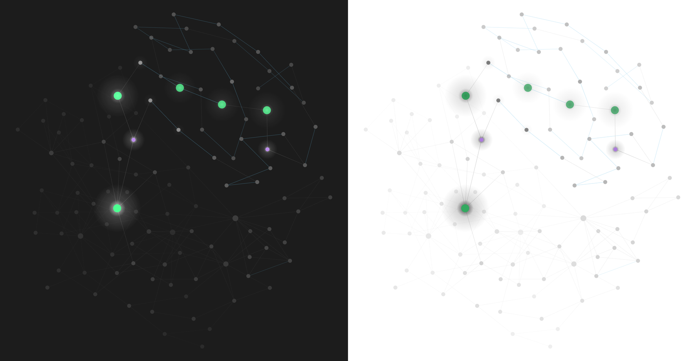

# The graph

What Pulsar draws on the graph beyond the fade itself: stars, size, the age
above a node, the newest note, the glow between neighbours, folder temperature,
and what the links carry.

## Stars and black holes

Off unless you turn it on, at the top of *The graph* in the settings or under
*Nodes* in the graph's own panel.

The top of the fade runs out of room. Past full strength the renderer lightens
a node channel by channel until every channel is at its limit, so the newest
notes of a vault all end up the same white and nothing in their colour says
which is newer. A star is drawn around the node instead of in it: a soft glow,
six node widths across on the newest note and narrowing to three on the last
one counted, strongest on the newest.

On a light theme light on white changes nothing, so the glow is black instead,
and the newest notes sit in a pool of it. Same notes, same shape; it switches
when the theme does.

  

**How many** is a count of the newest notes, ten unless you change it, up to
250. In a local graph measured against its own notes it is that graph's own
newest, the same rule the spotlight follows. Nothing is drawn during the
graph's replay, which is about the past.

**Pulse** makes each one brighten and dim at its own pace. Each note draws how
long a breath takes from a normal distribution, a little over three seconds and
never under two or over five, so a field of them drifts in and out of step and
shimmers rather than breathing as one. A note keeps its pace while it stays a
star, and across reloads. Every star swings by the same amount either side of
its own level, so the newest stay the brightest, and none goes all the way out.
A glow also grows by two of its note's widths at the top of each breath, which
is what lets the small ones be seen to move: brightness alone barely changed a
glow three widths across. It costs something a still graph does not. Obsidian stops
drawing a graph once nothing has moved for about a second; a pulse draws it
again up to 30 times a second without waking it (22 a second with 250 stars on
2,887 notes), which measured about a fifth of one core between the window and
the GPU, against nothing for stars that hold still.
While anything else is moving, the breath rides Obsidian's own frames instead. A
graph in a background tab or a minimized window draws nothing for it. It moves
even while your system asks for reduced motion (on Windows, with animation
effects turned off), because it is off until you turn it on; the setting says so
when your system is asking.

Each glow hangs off its node's own circle, so it moves, zooms, dims on hover and
leaves the screen with the node without being told. The note is drawn
again over its own glow, so it keeps its colour, the spotlight's and a pin's
included, while the light falls on the links and notes around it. It never takes the pointer: hovering
where a glow is drawn does what it would do with no glow there.

## Size

Obsidian already sizes a node, and it is worth knowing how: `getSize()` is
`node size slider × clamp(3 × √(links + 1), 8, 30)`. Links, and nothing else.
That formula does not leave its floor until a note has **seven** links, so in a
real 1088-note vault 381 of the first 400 nodes came out at exactly 8. The size
channel is almost entirely unused, which is what makes it worth spending on age.

**Size nodes by age** multiplies Obsidian's own number rather than replacing it,
so a hub still reads as a hub. You set what the oldest and the newest are
multiplied by; putting the newest *below* the oldest runs it backwards, which is
a reasonable thing to want.

**Title size** scales every name on the graph, and the age drawn above a node
with it. Obsidian offers no control over
this at all — a title's font is `14 + size / 4`, tied to the node size, so a
small-node graph gets small titles whether or not you wanted that. This
separates them.

Neither reaches the simulation. Obsidian's own node size slider doesn't either:
the physics run in a worker with their own copy of the graph, so a bigger circle
doesn't push its neighbours any harder.

## Hover and spotlight

A note's age — "3 days ago", "5 months ago" — is drawn above its node, centred,
the same distance up as the title sits down, in the same font and a little
quieter. It's part of the graph, not a tooltip over it, so it pans and zooms with
everything else. Obsidian's own page preview still works alongside it.

  

**Show note age** has three settings:

| | |
|---|---|
| **Never** | No ages at all. |
| **On hover** | The age appears above whichever node you're pointing at. The default. |
| **Whenever titles are shown** | Every node that's showing its name shows its age too, dimmed by that note's own opacity. |

That last one is worth a try if you already use the text fade threshold the way I
do: the names come in as you lean towards the graph, and now the dates come with
them, with old notes carrying faint ones.

**What it covers** is a choice between two different questions.

| | |
|---|---|
| **The newest few notes** | A count. At 1 it marks the thing you touched last; at 5 it marks the last five, which reads as *where you have been* rather than *where you are*. |
| **Anything touched recently** | A window. Every note worked on in the last so many minutes, however many that is — including none. |

The difference is that **a count always answers**. Ask for the newest three and
you get three, whether you have been writing all morning or have not opened the
vault since March. Measured in a real vault at an idle moment, the top three were
21, 34 and **124 minutes** old — so a count of three was marking a note left two
hours ago as where you are.

A window goes quiet when you do. In the same vault at the same moment: nothing in
the last 15 minutes, one note in 30, two in an hour, four in three hours, 19 in a
day. The spotlight simply went dark, which is the true answer.

It has no upper bound, and that is the trade. The busiest half-hour in that
vault's history touched **623 notes** — a bulk import — and a 30-minute window
during one of those lights the whole graph. That is not wrong, exactly: a lot
really did just change. But if a sync or a mass rename makes your graph flare,
that is why, and a count is the setting that cannot do it.

Each spotlit note keeps the colour it had underneath, so turning it back down
hands them all back.

**Spotlight size** makes the newest note's circle larger as well as coloured.
Worth knowing why it needs to: Obsidian sizes a node by its link count and
nothing else, and the note you wrote last is almost always the least linked thing
in the vault — so without this the one node you always want to find is reliably
the *smallest* on screen. It multiplies on top of any other sizing rather than
replacing it.

The spotlit note is also never hidden by the age filter, on the same rule as the
note you have open. A filter quietly removing the one node the graph is pointing
at is the graph disagreeing with itself.

## Neighbour glow

A note doesn't live alone. **Neighbour glow** lets a bright note lift the notes
it links to, so an area you're working in reads as a region rather than as
scattered points. Each node takes the better of its own brightness and a fraction
of its brightest neighbour, and **Glow reach** decides how many links that
travels along — each step carries the fraction again, so it falls away with
distance.

It starts at 0.35, one link out. On the default curve that lifts about one note
in nine in the demo vault, the neighbours of what you're working on, for 4% of
the graph's contrast; at 0.5 it is nearly one in five.

Worth knowing: the glow travels along links, and grouping by *island of linked
notes* draws its boundaries along those same links. The glow runs first for
exactly that reason — warming first would hand every node neighbours identical to
itself and leave the glow nothing to lift.

How much it does for you depends on how linked your vault is. Mine is sparse —
about 700 links across 1060 notes — so the effect is real but gentle. A densely
linked vault will see much more.

Off by default.

## Group temperature

**Group temperature** pulls every note toward the middle of the group it belongs
to, so a part of the vault reads as alive or as cold at a glance instead of
having to be picked out note by note. Unlike the glow below, it moves notes
**both ways**: a stale note in a busy folder comes up, a fresh one in an
abandoned corner goes down.

Group by folder or by island of linked notes. Folders suit most vaults — mine
splits into regions that genuinely differ:

| Folder | Notes | Mean brightness |
| --- | ---: | ---: |
| 2 Areas | 177 | 0.75 |
| _Journal | 387 | 0.17 |
| 3 Notes | 78 | 0.17 |
| 4 Reference | 81 | 0.14 |
| 5 Archive | 206 | 0.11 |

Islands of linked notes only work if your vault actually has islands. Mine has
686 of them, and 633 are single notes with one blob of 421 in the middle, so
folders tell me far more. Check yours before reaching for it.

Off by default.

## Links carry age too

Obsidian draws every link in one flat colour whatever its two ends have been
through, which leaves the busiest half of the picture saying nothing about time.
**Age the links too** changes that:

- **Match the newer note** gives a link the age of its livelier end, so the
  structure around recent work comes forward instead of sitting in uniform grey.
- **Fade between the two** fades each link along its length, bright at the newer
  note and dim at the older one.

That second one is worth it for the discovery thing: a bright line running out of
today's work and dimming into something you wrote a year ago is exactly the note
you'd forgotten you had. *Fade between the two* is on by default, so a new install
shows it straight away.

## What you wrote together

**Trace what was written together** colours the link between two notes that were
saved close enough together to have been open in the same sitting. It says
nothing about *how long ago* — the fade already does that — so the two read as
separate facts: colour for togetherness, brightness for age. It is also a
switch in the graph's own panel, **Pulsar › Links › Trace sittings**, for
turning it on while looking at the graph it changes.

How much it catches depends on how you work. On my vault a 5 minute window
already marks 246 of 692 links, and stretching it to 4 hours only reaches 312,
which says most of my linked notes were written in genuine bursts rather than
drifting together over an afternoon.

On by default, with its own colour kept clear of the spotlight's. **Trail
strength** mixes that colour with the one links are normally drawn in — at full
strength it is a stripe of neon, and a little under half way reads as a warmer
line, which is much easier to sit with.

## The replay

Obsidian's graph has a timelapse of its own — the **Animate** button under
*Display* in its control panel. It empties the graph and rebuilds it in the
order the notes were created. In the settings this is the *Animate* section.

Run it with Pulsar on and it is almost black. Every note it draws is drawn at the
brightness it has **today**, and the notes that existed early are the old ones,
so the replay spends most of its length showing a dark graph and lights up only
in the final seconds.

That is not a figure of speech. Measured in a vault of 1096 notes, taking the
notes that existed at a given moment and grading them the way a replay does:

| The moment | Notes that existed | At full brightness | At minimum |
|---|---|---|---|
| 360 days ago | 20 | **0** | 20 |
| 180 days ago | 72 | **0** | 72 |
| 90 days ago | 102 | **0** | 99 |

Every note, at the bottom of the range, for the whole first half of the replay.

**Light the timelapse as it plays** measures each note from the moment the replay
has reached instead of from today. A note is at full brightness as the wave
arrives and cools behind it, so the replay becomes what it is actually showing:
the vault being written.

It reads **when each note first appeared**, not when it was last touched — the
lower of the two timestamps, since sync and file copies push a creation time past
a modification time. That is also how Obsidian orders the replay itself. Reading
modification times instead would light a note at the start of the replay because
you edited it yesterday, which is the thing being fixed.

**Stays lit for** is how long a note holds its brightness behind the wave, in
days *of vault time* rather than of watching. A vault that has been going for
years wants a longer trail than one that is months old; a dense patch of history
lights more notes at once than a sparse one, because that is what was happening.

While a replay is running, everything else that decides brightness stands aside:
the glow, group temperature, the local-graph scale, pins and the spotlight. A
replay is a question about one moment in the past, and all of those are answers
about the present. The spotlight in particular would point at a note that has not
been written yet.

Nothing here is playback of ours. The button, the speed and the stepping are
Obsidian's; this supplies the one thing the animation has no way to know, which
is what the vault looked like at the moment it is showing. The wave ends by
itself when the replay catches up with the vault, because at that point the
newest note on screen *is* the newest note there is.

---

[← All docs](README.md) · [Pulsar](../README.md)
