# Performance

[← Back to the docs](README.md)

What Pulsar costs, where that time goes, and how it was measured, release by release.
Every figure on this page is recomputed from the files in
[`bench/results/`](../bench/results) by [`bench/performance.ipynb`](../bench/performance.ipynb),
which also draws every chart. The method, the machine and the weaknesses are all here,
so that any of it can be checked or argued with.

Measured on 7 and 8 October 2026: Pulsar 1.38.0, 1.39.0 and 1.40.0, each pull request
between them, and #125, the 1.41.0 fix for the one question 1.40.0 left open. A figure
written `a ± b (n)` is the mean and sample standard deviation of n individual samples.

- [In short](#in-short)
- [Where the time goes](#where-the-time-goes)
- [How it was measured](#how-it-was-measured)
- [Results, release by release](#results-release-by-release)
- [Flame graphs](#flame-graphs)
- [Threats to validity](#threats-to-validity)
- [Corrected after release](#corrected-after-release)
- [Found, and closed without a fix](#found-and-closed-without-a-fix)
- [Solved: the fresh-writing reconfigure](#solved-the-fresh-writing-reconfigure)
- [How to reproduce](#how-to-reproduce)

## In short

All four builds side by side in one 32-minute session, the order rotated every round
and every run kept.

| | Pulsar off | 1.38.0 | 1.39.0 | 1.40.0 |
|---|---|---|---|---|
| Open the global graph at 20,000 notes, until settled (n = 6) | 30.65 ± 3.88 s | 10.94 ± 0.76 s | 6.16 ± 0.11 s | 6.14 ± 0.15 s |
| … main thread blocked meanwhile | 25.84 ± 4.31 s | 5.02 ± 0.69 s | 0.30 ± 0.05 s | 0.28 ± 0.03 s |
| Note switch at 20,000 notes, blocked, both notes in range (n = 60) | not run | 149.6 ± 12.0 ms | 78.3 ± 7.1 ms | 75.3 ± 6.4 ms |
| … both notes out of range (n = 60) | not run | 157.2 ± 9.7 ms | 119.0 ± 7.5 ms | 117.6 ± 10.0 ms |
| A graph whose timelapse has run, at rest, renderer CPU (n = 40 one-second windows) | 0.072 ± 0.005 cores | 0.315 ± 0.019 cores | 0.073 ± 0.006 cores | 0.078 ± 0.020 cores |
| Editor reconfiguration per load, fresh writing off (n = 10) | — | 2 calls, 9.2 ± 1.0 ms | 2 calls, 8.6 ± 0.8 ms | none |
| … fresh writing on (n = 10) | — | 2 calls, 7.2 ± 0.7 ms | 2 calls, 8.4 ± 0.6 ms | 1 call, 14.7 ± 1.6 ms |

The graph rows are the bench vault (20,000 generated notes, the author's age filter,
which keeps 4,168 of them). The timelapse and editor rows are the 112-note demo vault.
The last row is the time inside the calls, and 1.40.0's includes a restyle of the whole
window that 1.38.0 paid just after its calls instead; with every restyle forced and
timed, a load with fresh writing on is no slower in 1.40.0 than in 1.38.0
([solved below](#solved-the-fresh-writing-reconfigure)).

<picture>
  <source media="(prefers-color-scheme: dark)" srcset="assets/perf/open-20k-dark.svg">
  
</picture>

- **1.39.0 is where the graph got cheaper.** Opening the filtered graph settles 1.8×
  sooner than in 1.38.0 and blocks the main thread 17× less, because the graph is
  filtered before Obsidian builds it rather than after. A note switch blocks for 71 ms
  less when it cannot change what the graph shows, and 38 ms less when it can. A graph
  whose timelapse has run goes back to sleep, as it does with Pulsar off.
- **1.40.0 changed nothing measurable on the graph.** Opening the graph and switching
  notes moved by under half a standard deviation from 1.39.0. The timelapse row moved by
  0.8 sd, all of it from two consecutive seconds at 0.17 and 0.16 cores while the graph
  was not drawing; without them 1.40.0 reads 0.073 ± 0.004 cores.
- **1.40.0 looked slower on load with fresh writing on, and was not.** It no longer
  reconfigures every open editor on load while fresh writing is off, the default. With it
  on, the one remaining call measured 14.7 ms against 7.2 ms for 1.38.0's two, because
  the call now included a restyle of the whole window. Timed with every restyle forced,
  a load cost 25–28 ms against 31–34 ms in 1.38.0, and 1.41.0 (#125) removed most of the
  restyle: 20.1 → 8.9 ms. See
  [the fresh-writing reconfigure](#solved-the-fresh-writing-reconfigure).
- **With the filter on, Pulsar makes a big graph cheaper than Obsidian alone**, because
  it hands Obsidian 4,168 nodes instead of 20,000. Without a filter, 1.38.0 added 15%
  to a note switch at 20,000 notes and 14–35% across the smaller vaults; see
  [the baseline](#138-against-pulsar-off).

## Where the time goes

Pulsar's work happens on five occasions: when Obsidian hands a graph new data, when a
graph draws a frame, when the active note changes, when the plugin loads, and when the
edit history is written. Its only timers repaint the tab bar every 30 seconds and the
status bar every minute; the 30-second one repaints the graph too, but only while the
spotlight is set to a time window, which is off by default.

### A graph rebuild: the data hook

Pulsar wraps each renderer's `setData`. The age filter runs there, on the engine's data
before Obsidian sees it, and the graph is repainted afterwards because `setData` resets
every node's colour. Two things make this path cheap now:

- **A new graph is filtered from its first build** (#110). Obsidian builds a graph view
  from the whole vault in its constructor, before any layout event a plugin could react
  to, so up to 1.38.0 every open laid out all 20,000 nodes and then threw most away.
  Pulsar now wraps the function Obsidian uses to create each graph view. In every
  1.39.0 and 1.40.0 open, the first build already held 4,168 nodes; in every 1.38.0
  open it held 20,000, and dropped to 4,168 within 3 seconds.
- **The same data is not handed on twice** (#108). Once started, Obsidian's timelapse
  calls `setData` about nine times a second with identical data. Passing it on reset
  every colour and woke the renderer, so a graph whose timelapse had run never went
  idle. The hook now compares the data with what it handed over last and does nothing
  when they match.

### The filter

A refilter runs the filter over each open graph again. In the author's vault (1,115
notes, 241 kept) one refilter took 1.162 ± 0.253 ms in 1.38.0 and 0.343 ± 0.048 ms
after #108 (n = 30 batches), which stopped a refilter that keeps the same notes from
rebuilding the graph. At 20,000 notes, 1.38.0's refilter took 45.8 ± 9.1 ms (n = 20).

What matters more is how often it runs. Since #109, a note switch refilters only when
it can change what is shown: the open note is exempt from the filter, so only a switch
to or from a note outside the range needs one. In the rerun, 1.38.0 refiltered once per
switch for both pairs of notes; 1.39.0 and 1.40.0 refiltered for none of the in-range
switches and once for each out-of-range one.

### A frame: the render hook

Pulsar also wraps `renderCallback`, which runs after every frame of a moving graph. It
places the age labels and applies node size by age. A settled graph draws no frames, so
at rest this costs nothing.

One frame of a moving graph, 1.38.0 against Pulsar off. The bench ran with defaults,
the demo with its own settings and all 112 nodes drawn, and the author's vault with its
filter switched off in memory so that both arms drew the same 1,115 nodes:

| Vault | Nodes | 1.38.0 | Pulsar off |
|---|---|---|---|
| Demo | 112 | 1.24 ± 0.18 ms (199) | 1.24 ± 0.17 ms (199) |
| Bench | 1,000 | 4.73 ± 0.71 ms (120) | 4.48 ± 0.61 ms (120) |
| Bench | 5,000 | 23.61 ± 1.60 ms (119) | 23.28 ± 1.42 ms (119) |
| Bench | 20,000 | 103.04 ± 7.78 ms (59) | 98.41 ± 5.27 ms (59) |
| The author's vault | 1,115 | 8.82 ± 1.07 ms (199) | 7.88 ± 0.79 ms (200) |

With the author's settings at 20,000 notes, 4,168 drawn, a frame took
10.02 ± 1.30 ms (60). The CPU profile of the same frames puts 1.81 ms of it in Pulsar's
own code, mostly the size and label pass (`sized.getSize`, `wants`, `sync`). That pass
is the subject of [item 6](#found-and-closed-without-a-fix).

### A note switch

On `file-open` and `active-leaf-change`, Pulsar records the switch, repaints the tab
bar and status bar, refilters if it has to, and repaints every open graph (`applyTo`:
opacity, neighbour glow, warmth by linked island). Inside its handlers at 20,000 notes,
4,168 drawn, notes in range (n = 40 each):

| Handler | #110 | #111, shipped in 1.39.0 |
|---|---|---|
| `applyTo` | 55.99 ± 6.33 ms | 29.25 ± 5.36 ms |
| `syncRenderers` | 28.36 ± 4.01 ms | 0.06 ± 0.05 ms |
| `spotlitFrom` | 7.68 ± 1.14 ms | 5.32 ± 0.89 ms |
| `exemptFromFilter` | 3.24 ± 0.43 ms | 1.91 ± 0.48 ms |
| `paintTabs` | 2.51 ± 0.51 ms | 2.39 ± 0.41 ms |

<picture>
  <source media="(prefers-color-scheme: dark)" srcset="assets/perf/switch-handlers-dark.svg">
  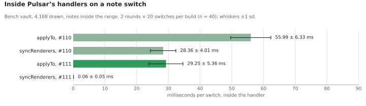
</picture>

Up to #110, a switch painted every graph twice in one task. `active-leaf-change` led to
`syncRenderers` and a paint; then Obsidian's own `file-open` handling rebuilt the graph
around the opened note, and the data hook painted it again. The rebuild resets every
colour, so the first paint was never drawn. #111 defers the first paint to a microtask,
which the second one settles. After a settled switch, every node's colour, alpha and
drawn tint matched between the two builds: 0 nodes differed in any of 8 snapshot pairs
of 4,168–4,169 nodes.

In small vaults a switch never blocks for 50 ms, so it is measured to the second frame
instead. In the demo, 1.38.0 took 19.0 ± 1.7 ms against 14.1 ± 1.8 ms with Pulsar off
(n = 30), and #111 13.24 ± 1.51 ms (n = 40).

### Loading the plugin

In the author's vault, a 1.38.0 load took 405.5 ± 36.7 ms to `enablePlugin` (n = 10).
The larger steps inside it, each inclusive of what it calls, so they do not add up:

| Step, 1.38.0, the author's vault (n = 10) | ms |
|---|---|
| `onload`, until done | 282.9 ± 24.8 |
| Reading the edit history, until done | 135.4 ± 16.8 |
| `syncRenderers` | 77.9 ± 6.6 |
| Attaching to graphs | 69.9 ± 4.6 |
| `workspace.updateOptions` (an editor reconfiguration) | 34.4 ± 3.8 |
| `registerEditorExtension` (another) | 16.7 ± 3.0 |

The load profile adds one more: building Pulsar's section in the graph's own panel spent
59.8 ms per load under Obsidian's dropdown, 58.6 ms of it reading `offsetWidth`, which
forces a layout ([item 4](#found-and-closed-without-a-fix)). In the demo the same
dropdown cost 8.6 ms per load.

In the demo with six editors open, a whole load took 56.06 ± 6.44 ms in 1.38.0 and
45.35 ± 3.30 ms in 1.40.0 on defaults, and 62.04 ± 7.69 ms and 65.11 ± 4.37 ms with
fresh writing on (n = 10 each).

### Writing the edit history

The history file is written 5 seconds after the last edit, and once every 5 minutes
while the app sits idle, as asynchronous file I/O. Reading it is part of every load:
135 ms until done in the author's vault, including the asynchronous read of a file of
about 95 KB. Since 1.41.0 (#123), each write puts a backup copy down first, and its pull
request measured about 2 ms more per write: a `flush()` of the demo's 8 KB history went
from 2.40 ± 0.45 to 5.12 ± 1.13 ms in one round and from 4.84 ± 8.79 to 5.50 ± 3.86 ms in
another (n = 30 each). Those figures were printed during the session and never saved,
so nothing here can recompute them.

## How it was measured

### The machine

| | |
|---|---|
| Computer | ASUS TUF Gaming A16 (FA617NT), a laptop |
| CPU | AMD Ryzen 7 7735HS: 8 cores, 16 threads, 3.2 GHz base |
| Memory | 64 GB DDR5, two 32 GB modules rated 5600 MT/s, running at 4800 MT/s |
| Graphics | AMD Radeon RX 7700S and the CPU's integrated Radeon. Electron listed both and Windows' basic renderer and marked none active, so which one drew the graph is unknown |
| Displays | built-in 1920×1200 at 165 Hz, an external 1920×1080 at 60 Hz, and a third at 2400×1350, all at 125%. In the rerun the bench window sat on one reporting 165 Hz and the demo window on one reporting 59 Hz |
| System | Windows 11 Home, build 26200, 64-bit, Balanced power plan |
| Obsidian | 1.14.4 on installer 1.13.7; Electron 43.3.0, Chromium 150.0.7871 (read from strings in the executable, not from the running app) |
| Driven from | WSL2 on the same machine, through Obsidian's command-line `eval` |

The hardware was read from Windows after the first session. The rerun saved its own
record with every run: CPU, display, power and window state (below).

### The vaults

- **The bench vault**, generated by [`bench/live/genvault.py`](../bench/live/genvault.py)
  with a fixed seed: numbered one-line notes in 20 folders, 1 to 4 links each by
  preferential attachment, ages exponential with a 90-day mean, capped at two years.
  Grown from 1,000 to 5,000 to 20,000 notes, keeping the earlier ones. Measured either
  with Obsidian's defaults or with the author's settings copied in, whose age filter
  keeps 4,168 of the 20,000 (20.8%, close to the 21.6% it keeps at home, but only
  because the invented ages happen to land there).
- **The demo vault**: 112 notes with spread-out modification times, titles only, and
  Pulsar as its only plugin. In the rerun its own filter drew 57 of the 112.
- **The author's vault**: about 1,100 notes and 31 plugins; the global graph has 1,115
  nodes, of which the filter keeps 241. Only counts and timings left it. Its settings
  were changed in memory only, history writes were blocked during runs, and its settings
  file was compared byte for byte afterwards. Six graph views closed earlier were still
  running Obsidian's timelapse throughout, using about a third of a core whether Pulsar
  was on or off.

### The live harness and its instruments

One script, [`bench/live/harness.mjs`](../bench/live/harness.mjs), evaluated inside the
target vault's window, did every run. It checks the vault's name first and stops if it
is wrong, because the CLI sends commands to whichever window has focus. Every run wrote a
JSON file, and apart from the per-call timings below, it holds every sample rather than
a summary.

- **Main thread blocked**: the sum of long tasks (tasks over 50 ms, from a
  `PerformanceObserver`) starting inside a window after the action: 600 ms for a note
  switch, until the layout settled for opening a graph.
- **Second frame**: from `setActiveLeaf` to the second `requestAnimationFrame` callback,
  which covers the switch's own work and the first frame that shows it.
- **Settled**: the renderer's `idleFrames` passing 60, polled every 200 ms, with a cap
  of 90 s in the first session and 120 s in the rerun.
- **CPU in cores**: Electron's `percentCPUUsage` for the window's renderer process,
  read once a second, × 16 logical processors ÷ 100.
- **One call**: the function called k times per sample, k chosen so that a sample lasts
  at least 2 ms, because `performance.now()` here reads in 0.1 ms steps; 3 warm-up calls,
  then 30 samples (20 at 20,000 notes). Only the summary of these was saved.
- **Editor reconfigurations**: `workspace.updateOptions` wrapped, each call counted and
  its synchronous part timed, over ten disable-and-enable cycles of the plugin. A timer
  around one call also bills it for any restyle the code before it left pending, which
  is how 1.40.0's call came to look twice as slow ([T21](#threats-to-validity)). The
  follow-up harness forces and times every pending restyle at fixed points instead.
- **Flame graphs**: the Chrome DevTools Protocol CPU profiler sampling every 100 µs, on
  an unminified build (`npm run build:profile`) so that frames carry real names.

### The keep rule

A change is kept only if its mean moves by more than twice the standard deviation of the
individual "before" samples, and nothing else measured gets slower. It is an effect-size
bar, not a significance test; [T4 and T17](#threats-to-validity) are about what that lets
through and what it rules out.

### Two sessions

**The first session** (11:20–18:41) measured each fix against the build just before it,
one pull request at a time. It left three gaps: 1.38.0 was never run beside 1.39.0, no
1.38.0 build was ever timed opening a graph, and nothing recorded which build was loaded
or what state the window was in.

**The one-session rerun** (22:48–23:20) closed them. Driven by
[`bench/live/rerun.sh`](../bench/live/rerun.sh), it ran Pulsar off and the three release
builds in rounds, rotating the order every round, and kept every run:

| Test | Rounds | Order, round by round |
|---|---|---|
| Open the global graph, bench 20k | 6 × 1 open | off 1.38 1.39 1.40 · 1.38 1.39 1.40 off · 1.39 1.40 off 1.38 · 1.40 off 1.38 1.39 · off 1.38 1.39 1.40 · 1.38 1.39 1.40 off |
| Note switch, bench 20k | 3 × 20 switches per pair, after 2 warm-up switches and a fresh graph per build | 1.38 1.39 1.40 · 1.39 1.40 1.38 · 1.40 1.38 1.39 |
| Timelapse at rest, demo | 2 × 20 one-second windows | off 1.38 1.39 1.40 · 1.40 1.39 1.38 off |
| Editor reconfigurations, demo | 1 × 10 loads per mode | 1.38 1.39 1.40, defaults then fresh writing on |

The open order above is read back from the runs' own timestamps. Every run saved a
metadata file beside its results, and the notebook checks them:

- **Build**: the sha256 of the loaded `main.js` matched the release asset in all 48 runs
  with Pulsar loaded (1.38.0 `f17fcba7…`, 1.39.0 `f4ecc4cc…`, 1.40.0 `423f54ba…`).
  Pulsar was not loaded in any of the 8 "off" runs.
- **Window**: focused and visible in all 56 runs and the smoke test.
- **Display**: the bench window on the 165 Hz display, the demo window on the 59 Hz one,
  both at 125%. Frame timings from the two vaults are therefore not comparable.
- **Power**: on mains throughout.
- **Other load**: every other Obsidian process together, mostly the author's vault's
  leftover timelapses, used 0.50–0.94 cores during the measured runs.

### The vitest benchmarks

`npm run bench` times the opacity store and the range readout over synthetic vaults of
1,000, 10,000 and 50,000 notes, in Node rather than in Obsidian. Three runs back to back
on the same laptop under WSL2 (Node 20.19.3), each cell giving the lowest and highest of
the three run means:

| Benchmark | 1,000 notes | 10,000 notes | 50,000 notes |
|---|---|---|---|
| Every opacity, recomputed | 0.18–0.21 ms | 2.5–3.5 ms | 14.8–21.8 ms |
| Newest 3, as the spotlight picks them | 0.021–0.024 ms | 0.37–0.41 ms | 6.9–11.5 ms |
| Newest 3 by a full sort (the old way) | 0.26–0.27 ms | 3.7–4.9 ms | 37.0–44.1 ms |
| The range readout, once per pass | 0.095–0.118 ms | 1.9–2.5 ms | 23.2–38.7 ms |
| The range readout, once per note (the old way) | 254–287 ms | not run | not run |

The spread between runs is as large as 1.7× at 50,000 notes, so these say which way and
by roughly how much, not where a regression gate should sit.

## Results, release by release

### 1.38.0 against Pulsar off

The baseline every fix started from, with defaults, so no filter and every node drawn:

<picture>
  <source media="(prefers-color-scheme: dark)" srcset="assets/perf/baseline-switch-dark.svg">
  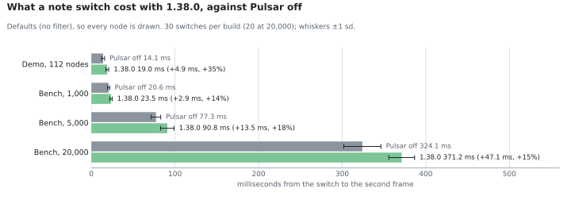
</picture>

| Vault | Pulsar off | 1.38.0 | Difference |
|---|---|---|---|
| Demo, 112 nodes | 14.1 ± 1.8 ms (30) | 19.0 ± 1.7 ms (30) | +4.9 ms, +35% |
| Bench, 1,000 | 20.6 ± 1.3 ms (30) | 23.5 ± 1.4 ms (30) | +2.9 ms, +14% |
| Bench, 5,000 | 77.3 ± 5.7 ms (30) | 90.8 ± 8.0 ms (30) | +13.5 ms, +18% |
| Bench, 20,000 | 324.1 ± 22.2 ms (20) | 371.2 ± 15.4 ms (20) | +47.1 ms, +15% |
| The author's vault | 79.1 ± 11.9 ms (30) | 91.9 ± 11.9 ms (30) | +12.8 ms |

The author's vault row is not like the others: with Pulsar on, its filter kept 241 of
the 1,115 notes, the global graph sat in a background tab in both arms, and only the
local graph drew ([T19](#threats-to-validity)).

### 1.39.0: the graph

Four fixes, each measured against the build before it in the first session:

- **#108**: a graph stops drawing once its data stops changing; a refilter that keeps
  the same notes no longer rebuilds the graph.
- **#109**: a note switch refilters only when it can change the graph, and a newly
  attached graph is filtered at once.
- **#110**: a new graph is filtered from its very first build.
- **#111**: a note switch paints each graph once.

Where the note-switch gain came from, at 20,000 notes:

<picture>
  <source media="(prefers-color-scheme: dark)" srcset="assets/perf/switch-steps-dark.svg">
  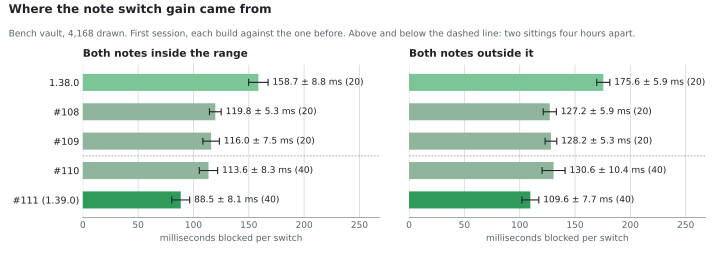
</picture>

| Step | In range | Out of range |
|---|---|---|
| 1.38.0 → #108 | 158.7 → 119.8 ms (4.4 sd) | 175.6 → 127.2 ms (8.2 sd) |
| #108 → #109 | 119.8 → 116.0 ms (0.7 sd) | 127.2 → 128.2 ms (1.0 ms slower) |
| #109 → #110 | 116.0 → 113.6 ms (0.3 sd) | 128.2 → 130.6 ms (2.4 ms slower) |
| #110 → #111 | 113.6 → 88.5 ms (3.0 sd) | 130.6 → 109.6 ms (2.0 sd) |

The first three rows were measured back to back at 13:46–13:50, n = 20 each; #110 and
#111 alternated over two rounds at 17:50–17:58, n = 40 each. #109 and #110 did not move
the switch and were kept for opening graphs and for correctness. Side by side in the
rerun, the whole of 1.38.0 → 1.39.0 is 149.6 → 78.3 ms in range and 157.2 → 119.0 ms out
of range.

Opening the graph, first session (n = 6 each, all runs kept): Pulsar off settled in
32.34 ± 1.85 s, #109 in 11.10 ± 0.33 s, #110 in 6.21 ± 0.07 s, blocking for 27.80, 5.10
and 0.25 s. The rerun's figures in [In short](#in-short) supersede these, since they put
1.38.0 beside the rest.

<picture>
  <source media="(prefers-color-scheme: dark)" srcset="assets/perf/switch-20k-dark.svg">
  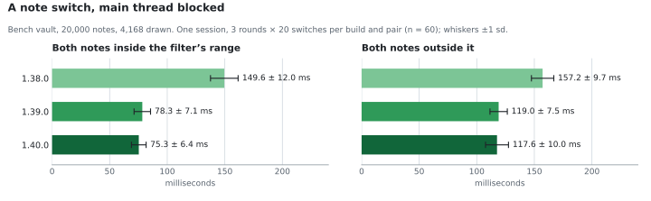
</picture>

The timelapse fix, in the rerun's demo window:

<picture>
  <source media="(prefers-color-scheme: dark)" srcset="assets/perf/timelapse-dark.svg">
  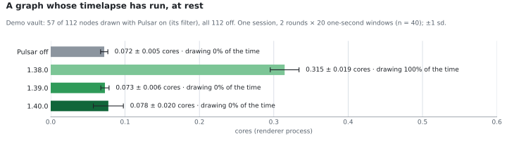
</picture>

In the first session the same comparison read 0.410 ± 0.024 cores for 1.38.0 against
0.078 ± 0.016 off and 0.076 ± 0.015 for #108 (n = 20). The rerun's 1.38.0 reads lower,
0.315, and two things changed in between: the demo's filter now draws 57 of 112 nodes
where all 112 were drawn before, and the rerun's window was on a 59 Hz display while the
first session's display was not recorded. A graph that never goes idle draws once per
display frame, so either could explain it, and these data cannot tell which.

### 1.40.0: editors, tabs and links

1.40.0 was mostly features, with one performance fix (#116). Each change was checked on
the path it touches:

| Change | Before | After | Moved |
|---|---|---|---|
| #113 · note switch, demo, second frame | 13.73 ± 1.72 ms (60) | 13.62 ± 1.59 ms (60) | 0.1 sd |
| #113 · note switch, demo, synchronous part | 7.30 ± 1.07 ms (60) | 7.31 ± 1.12 ms (60) | 0.0 sd |
| #114 · keystroke, demo | 0.380 ± 0.242 ms (600) | 0.321 ± 0.178 ms (600) | 0.2 sd |
| #116 · load to the next frame, demo, defaults | 56.20 ± 10.06 ms (20) | 46.62 ± 12.50 ms (20) | 1.0 sd |
| #116 · load to the next frame, demo, fresh writing on | 72.80 ± 10.21 ms (20) | 66.20 ± 5.43 ms (20) | 0.6 sd |
| #117 · keystroke, link dots off → on, two runs | 1.021 ± 0.377 / 1.173 ± 0.781 ms (300) | 0.988 ± 0.326 / 1.170 ± 0.376 ms (300) | printed only |

None of these clears the keep rule in either direction. #116's whole-load timings could
not resolve a saving of about 10 ms against a spread of 10–12 ms, so the evidence for it
is the count of reconfigurations, which the rerun saved: two per load in 1.38.0 and
1.39.0, none in 1.40.0 with fresh writing off, one with it on.

<picture>
  <source media="(prefers-color-scheme: dark)" srcset="assets/perf/reconfigure-dark.svg">
  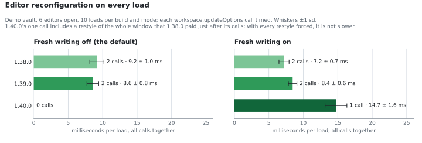
</picture>

### Everything on one scale

From a keystroke to opening a 20,000-note graph, on one logarithmic axis so that both
ends fit. Each row is the oldest and newest build that operation was measured on.

<picture>
  <source media="(prefers-color-scheme: dark)" srcset="assets/perf/scale-dark.svg">
  
</picture>

## Flame graphs

Sampled CPU time, root at the top and callees below, width proportional to time, idle
left out. Pulsar's own frames are green. Pulsar wraps Obsidian's render callback and
data hook, so much of Obsidian's drawing sits under a Pulsar frame; those wrapper
frames are drawn pale, because their time is their callees'. Read the bright green
frames, not the width of the pale ones. All are of 1.38.0 or a build before 1.39.0;
there is no profile of 1.39.0 or later.

<picture>
  <source media="(prefers-color-scheme: dark)" srcset="assets/perf/flame-bench-switch-dark.svg">
  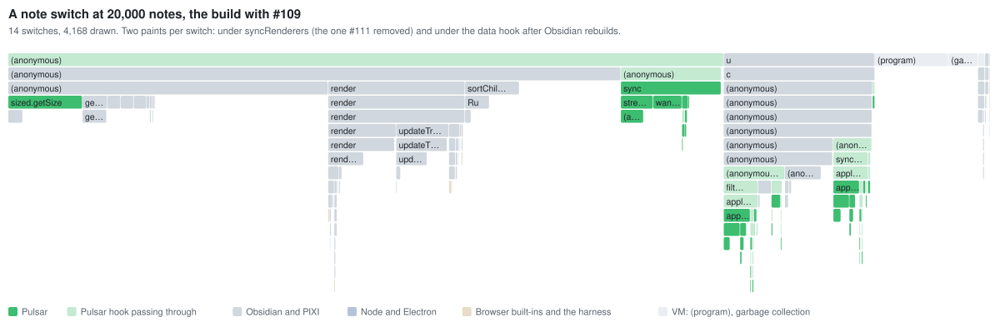
</picture>

**A note switch at 20,000 notes, the build with #109.** On the right are the two routes
into `applyTo`, about 31 ms each per switch: one under `syncRenderers`, the paint that
#111 removed, and one under the data hook after Obsidian rebuilds the graph for the
opened note. At the left, `sized.getSize` and the label pass run inside each frame the
graph draws while it moves afterwards.

<picture>
  <source media="(prefers-color-scheme: dark)" srcset="assets/perf/flame-bench-frame-dark.svg">
  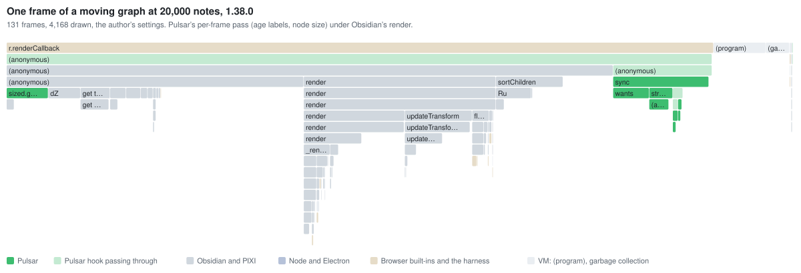
</picture>

**One frame of a moving graph, 4,168 drawn.** Most of the frame is Obsidian's PIXI
rendering under Pulsar's pale wrapper. Pulsar's own work is the narrow bright frames:
`sized.getSize` at the left and `sync` with `wants` at the right, about 1.8 ms of a
10.7 ms profiled frame.

<picture>
  <source media="(prefers-color-scheme: dark)" srcset="assets/perf/flame-demo-timelapse-on-dark.svg">
  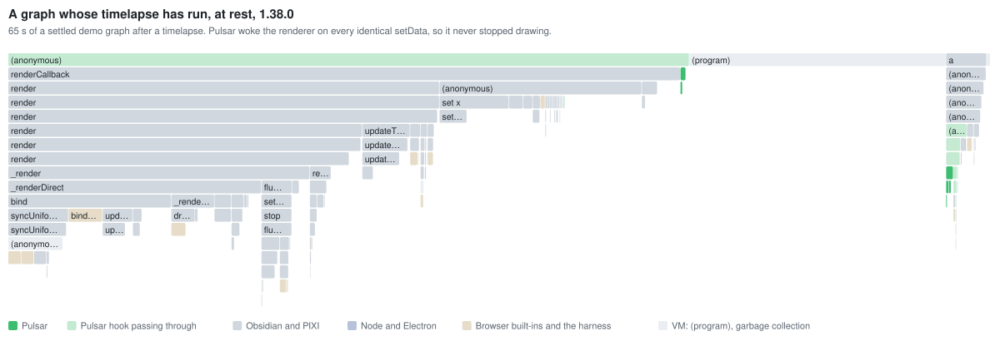
</picture>

<picture>
  <source media="(prefers-color-scheme: dark)" srcset="assets/perf/flame-demo-timelapse-off-dark.svg">
  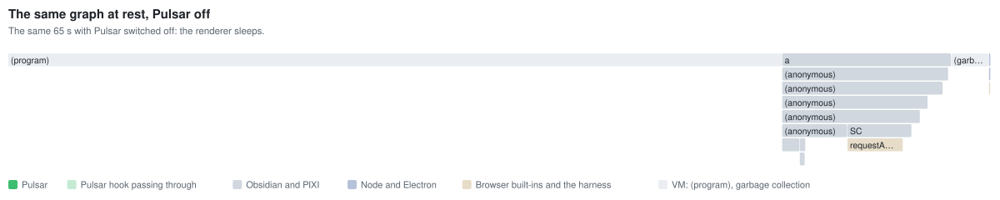
</picture>

**A graph whose timelapse has run, at rest: 1.38.0, then Pulsar off.** With 1.38.0 the
graph draws the whole time and the main thread is busy for 319 ms of every second; with
Pulsar off the same graph sleeps, and the main thread is busy for 41 ms. The difference
is the timelapse fix in 1.39.0.

<picture>
  <source media="(prefers-color-scheme: dark)" srcset="assets/perf/flame-demo-switch-on-dark.svg">
  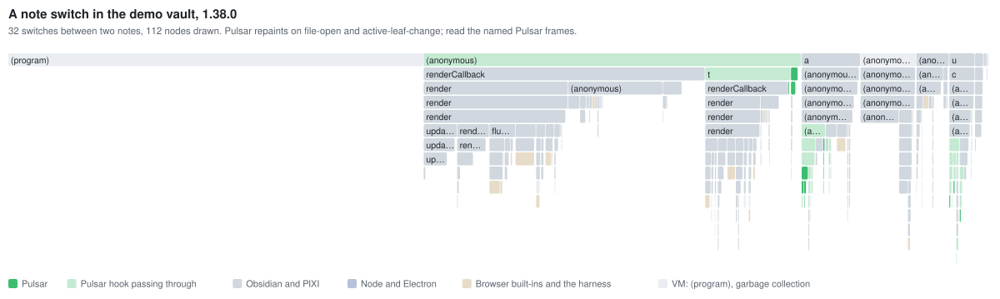
</picture>

**A note switch in the demo, 1.38.0.** Pulsar's own code is 5.15 ms per switch, spread
thinly across the repaint: `holdPaintTint`, `warmByGroup`, `poolNeighbours`,
`applyOpacity`. The same profile with Pulsar off still spends 1.12 ms per switch in
Pulsar-tagged frames ([T8](#threats-to-validity)).

<picture>
  <source media="(prefers-color-scheme: dark)" srcset="assets/perf/flame-demo-load-dark.svg">
  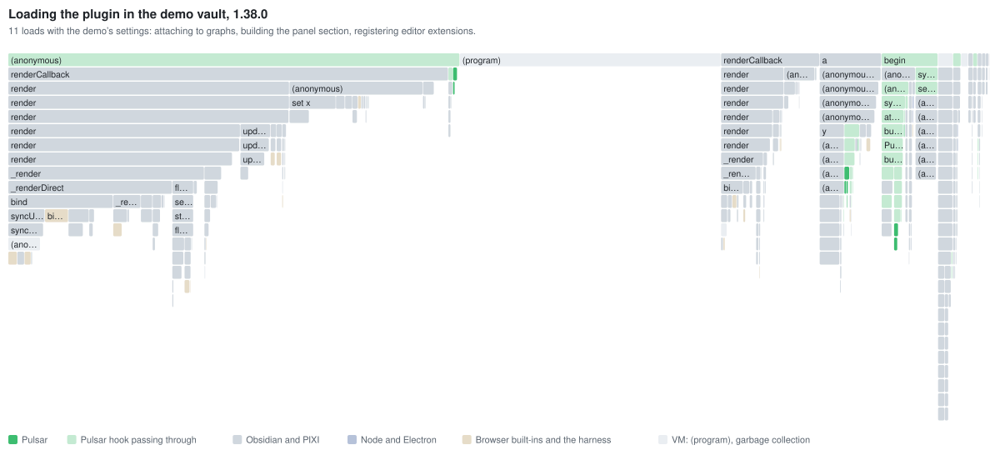
</picture>

**Loading the plugin in the demo, 1.38.0.** Most of the width is the graph redrawing
while the plugin loads, under Pulsar's pale render wrapper. The load itself is the
column on the right that starts at `begin`: attaching to the graphs, building the panel
section (`PulsarPanel`, with Obsidian's dropdown inside it) and registering the editor
extension.

## Threats to validity

Written to be argued with. Each names a weakness, how big it could be where that is
known, and what it touches. "Closed" means the one-session rerun removed it.

- **T1. One laptop, one day.** Everything comes from one Windows machine on the Balanced
  power plan. Its temperature was not recorded. Nothing was repeated on another
  machine, on macOS, or on a phone, where Obsidian's graph is the same code on much
  slower hardware.
- **T2. The bench vault is not a real vault.** One-line notes, invented exponential ages,
  no embeds, attachments, tags or other plugins. Graph cost follows nodes and links,
  which this matches only loosely, and which notes survive the filter depends on the
  made-up age distribution.
- **T3. "Blocked" only sees tasks over 50 ms.** Work split into shorter tasks does not
  register, which is why the small vaults read 0 and are measured to the second frame
  instead. A change that only chopped one long task into short ones would look like a
  win; the per-handler timings for #111 show that its gain is real work removed.
- **T4. The keep rule is an effect size, not a test.** It ignores n and treats samples as
  independent when they are not: switches alternate between the same two notes, and CPU
  windows are consecutive seconds of one run. #111's out-of-range result passed at
  2.02 sd, on the line. #109's switch change alone did not pass and was kept for other
  reasons.
- **T5. The first 1.39.0 switch figures joined two sessions.** *Closed:* the rerun put
  1.38.0 and 1.39.0 side by side. The baseline drifted by about 1 sd between sessions
  (166.8 ± 8.4 and 158.7 ± 8.8 ms for the same build, 82 minutes apart by the files'
  times; the earlier write-up said 85), and by about 1 sd within the rerun too: 1.38.0's
  three in-range rounds read 144.2, 148.5 and 156.0 ms.
- **T6. No 1.38.0 graph-open figure existed.** *Closed:* the rerun timed it. The first
  session's #109 table dropped each arm's first run as cold (Pulsar off 49.1 s, #109
  27.5 s); with all six, Pulsar off reads 34.0 ± 7.6 s and #109 14.4 ± 6.5 s. The only
  build before #109 ever timed opening a graph ran twice: settled at 39.0 s once, and
  not settled at the 90 s cap the other time, after 75 s of blocking.
- **T7. The profiler changes what it measures.** Sampling every 100 µs on an unminified
  build added 7–17% to the second frame: 107.7 against 91.9 ms in the author's vault,
  20.3 against 19.0 ms in the demo. Shares in the flame graphs are shares of a slowed
  program.
- **T8. "Pulsar off" still runs some Pulsar code.** Disabling Pulsar leaves its released
  wrappers in each renderer's chain, passing calls through, and a frame hook left by
  1.37.0 ([item 7](#found-and-closed-without-a-fix)) was still installed in the demo.
  The demo's "off" profile spends 1.12 ms per switch in Pulsar-tagged frames, so
  on-against-off slightly understates Pulsar's cost.
- **T9. First-session files carry stale version labels and no hash.** Each recorded the
  manifest Obsidian read at startup, so the 1.38.0 baseline is labelled 1.37.0. Builds
  were checked by md5 during the session, but the checks were printed, not saved.
  *Closed for the rerun:* every rerun file has the loaded build's sha256 beside it.
- **T10. Window state was not controlled.** Chromium throttles hidden and covered
  windows, and the second frame depends on refresh rate: 6.1 ms per frame at 165 Hz
  against 16.9 ms at 59 Hz. *Narrowed:* every rerun run was focused and visible, with its
  display recorded. The first session's were not, and the GPU in use is still unknown.
- **T11. The clock reads in 0.1 ms steps.** Per-call timings were batched to get past
  it; keystroke timings of 0.3–1 ms were not, so #114's 0.380 against 0.321 ms is a
  statement about a few ticks.
- **T12. Drift can be as large as the effect.** For #114, the same build read 0.452 ms
  in one round and 0.307 ms in the next, a larger gap than the one between builds.
- **T13. Load timings could not resolve #116.** *Closed:* the rerun saved the counts.
  Timing that one call is what exposed the open regression.
- **T14. Some numbers exist only in pull requests.** The harness printed them and did
  not write them to disk. They are listed in
  [`bench/results/pr-only.csv`](../bench/results/pr-only.csv) and marked "printed only"
  wherever they appear here.
- **T15. "Cores" rests on an assumption** that Electron's `percentCPUUsage` is a share of
  one processor, which is why it is multiplied by 16. If it is not, all the timelapse
  figures scale by the same factor and only their ratios hold. The GPU process is not
  counted, so drawing at full rate cost more than shown.
- **T16. The author's vault was not quiet.** Six leftover timelapses used about a third
  of a core through every run there. The refilter timing ran with the graph in a
  background tab, so it leaves out frame work, and its "after" run had one 16.5 ms
  outlier in `syncRenderers` (1.40 ± 2.86 ms, median 0.85).
- **T17. The keep rule cannot keep small per-frame wins.** Item 6 was closed because its
  largest possible gain, 1.8 ms of a 10.0 ± 1.3 ms frame, is under twice the frame's sd.
  With 60–120 frames, a 1.8 ms change would be easy to detect. The rule decided that,
  not the data.
- **T18. "Other load" is every other Obsidian process.** The 0.50–0.94 cores recorded
  beside each rerun run include the GPU and browser processes, which do work for the
  window being measured, not only the other windows.
- **T19. The author's-vault baseline is not like for like.** With Pulsar on, 241 notes
  were in a global graph that was not drawing; with it off, 1,115. Only the local graph
  drew in either. The +12.8 ms is Pulsar's cost in that vault as it was used, not a
  comparison with the bench rows.
- **T20. The vitest benchmarks run in Node, not Obsidian, and wander.** Between three
  back-to-back runs a mean moved by up to 1.7×. They rank approaches; they do not
  measure the plugin in place.
- **T21. A timer around one call can bill it for a restyle someone else left pending.**
  The browser restyles lazily, so the first call that needs styles pays for every change
  made before it. 1.40.0 moved three body properties from just after the reconfigure to
  just before it, and the call's time doubled without the call doing more. Every
  "synchronous part" and per-call figure on this page carries this risk. Only the
  reconfigure has been rechecked with restyles forced. Measures that run to a frame,
  such as a load to the next frame or a switch to the second frame, include the restyle
  wherever it falls, so they are not misled this way.

## Corrected after release

The 1.39.0 and 1.40.0 release notes were written from the first session, and four of
their figures did not hold up once the rerun put the builds side by side. #120 corrected
the changelog the same night, and the release notes on GitHub carry the same
corrections. The 1.40.0 entry was corrected a second time when the rerun's own
reconfigure figure turned out to include a restyle (#125).

| Figure | As published | First session's raw files | Rerun, one session |
|---|---|---|---|
| Switch in range, 1.38.0 → 1.39.0 | 158.7 ± 8.8 → 88.5 ± 8.1 ms | 158.65 ± 8.80 (20) → 88.50 ± 8.09 (40) | 149.57 ± 11.99 → 78.35 ± 7.15 (60) |
| Switch out of range, 1.38.0 → 1.39.0 | 175.6 ± 5.9 → 109.6 ± 7.7 ms | 175.55 ± 5.89 (20) → 109.62 ± 7.65 (40) | 157.18 ± 9.72 → 119.00 ± 7.53 (60) |
| Graph open, settled | 1.39.0 6.21 ± 0.07 s against 32.34 ± 1.85 s off | the same | 1.38.0 10.94 ± 0.76, 1.39.0 6.16 ± 0.11, off 30.65 ± 3.88 s |
| Timelapse at rest | 0.41 ± 0.02 → 0.08 ± 0.01 cores | 0.41 ± 0.02 → 0.08 ± 0.02 (20) | 0.31 ± 0.02 → 0.07 ± 0.01 (40) |
| Editor reconfiguration | "one reconfiguration measured 51 ms in a real vault" | two calls, 34.4 ± 3.8 and 16.7 ± 3.0 ms (10) | — |
| Fresh writing on, per load | "about 5 ms saved" (#116), then "14.7 ± 1.6 ms against 7.2 ms" (#120) | not measured | inside the calls, 14.74 ± 1.58 against 7.20 ± 0.73 ms; with every restyle forced, 25.10 ± 3.34 against 34.34 ± 3.52 ms ([below](#solved-the-fresh-writing-reconfigure)) |

- **The switch figures joined sessions four hours apart.** Side by side, the in-range
  gain held (71 ms against a published 70); the out-of-range gain was 38 ms, not 66.
- **The graph-open figure was true as written but read as the gain over 1.38.0.** No
  1.38.0 open had been timed. Against 1.38.0 the gain is 1.8× in settling and 17× in
  blocking, not the 5× and 110× that the comparison with Pulsar off suggested.
- **"One reconfiguration measured 51 ms"** was two calls together. With fresh writing
  off a load saves both, so about 51 ms in that vault; with it on, one goes.
- **#108's sd for the timelapse fix** was 0.0153 cores, which rounds to 0.02, not 0.01.
  The conclusion, the same as Pulsar off, stands.
- **"14.7 ± 1.6 ms against 7.2 ms"**, #120's own correction for 1.40.0, measured a
  restyle as well as the reconfigure. With every restyle forced, a load with fresh
  writing on is 25–28 ms after 1.40.0 against 31–34 ms in 1.38.0.

Two figures outside the changelog are still uncorrected. #116's description, and the
comment above `syncEditorExtensions` in `src/main.ts`, describe the 51 ms as one
reconfiguration and add "about 58 ms of CodeMirror measuring afterwards". The author's
load profile has one 58 ms item per load, and it is the panel dropdown's `offsetWidth`
read ([item 4](#found-and-closed-without-a-fix)); every other layout read in the load
comes to 9.9 ms per load together. The 58 ms looks like that dropdown, misattributed.

## Found, and closed without a fix

- **Item 4: building Pulsar's panel section forces a whole-window layout.** Obsidian's
  dropdown measures itself while the panel is attached: 59.8 ms per load under it in the
  author's vault, 58.6 ms of that reading `offsetWidth`, and 8.6 ms in the demo. The
  earlier, unpublished write-up of this profiling gave 0.5 ms for the demo; the demo's
  load profile does not reproduce that, and 8.6 ms is what it holds under the dropdown, mostly in `resizeToFit`. It scales
  with what is on screen, not with notes. Closed because most of it is a layout the
  window performs on its next frame anyway, which Pulsar only brings forward; building
  the section detached would leave the dropdown measured at zero width. This rests on the
  profile and on reading Obsidian's code; no before and after was run.
- **Item 6: per-frame work while a graph moves.** 1.81 ms of Pulsar's own code per frame
  at 4,168 nodes, against a 10.02 ± 1.30 ms frame. The earlier write-up said about 1.9 ms,
  because it also counted 0.11 ms of calls Pulsar makes into other code; here only time
  whose innermost frame is Pulsar's is counted. The age-label pass and the node-size
  override visit every node on every frame. It appears only with settings that are off by
  default, and a settled graph draws no frames. Closed under the keep rule, since 1.81 ms
  is less than twice the frame's sd (2.61 ms); see T17 for why that is the rule's verdict
  rather than the data's.
- **Item 7: 1.37.0's frame hook outlives the update.** The version being unloaded runs
  its own release code, and 1.37.0's had no off switch, so no later version can reach
  it. It lasts until that graph view is rebuilt or Obsidian restarts. From 1.38.0 on,
  every hook switches itself off on release.

## Solved: the fresh-writing reconfigure

The rerun timed every `workspace.updateOptions` call as the plugin loaded. With fresh
writing on, 1.40.0's one call took 14.74 ± 1.58 ms (n = 10), against 7.20 ± 0.73 ms for
1.38.0's two together, and that was first read as a regression.

It was not the reconfigure. Fresh writing's colours are three CSS custom properties, and
up to 1.40.0 they were set on `document.body`. A custom property is inherited, so
setting one restyles every element in the window. 1.40.0 sets them just before the call,
so the browser paid that restyle inside the timed call. 1.38.0 set them just after,
and paid the same restyle a moment later, outside the timer.

[`bench/live/restyle.mjs`](../bench/live/restyle.mjs) forces every pending restyle and
times it at fixed points: before each call, right after the last of the three properties
is set, and at the end of the load. That way no build can leave one for an untimed
frame. The test used the demo vault, fresh writing on, six editors and 10 loads per
build. Each comparison ran twice. The second round of each is in
[`bench/results/restyle/`](../bench/results/restyle); the first was printed and not kept.

| Per load, second round | 1.38.0 | 1.40.0 code path | The same, properties set after the call |
|---|---|---|---|
| Reconfigure calls | 2 | 1 | 1 |
| Time in the calls | 11.16 ± 1.76 ms | 4.74 ± 1.01 ms | 6.07 ± 1.91 ms |
| Restyle from the three properties | 15.44 ± 1.47 ms | 13.20 ± 2.46 ms | 15.19 ± 3.10 ms |
| Other pending restyles | 7.74 ± 1.21 ms | 7.16 ± 1.00 ms | 8.14 ± 1.50 ms |
| **Total** | **34.34 ± 3.52 ms** | **25.10 ± 3.34 ms** | **29.40 ± 4.43 ms** |
| Total, first round (printed only) | 30.80 ± 3.56 ms | 28.18 ± 5.53 ms | 24.36 ± 2.98 ms |

The "1.40.0 code path" is the default branch at #123, which loads the way 1.40.0 does;
its hash is in [`builds.csv`](../bench/results/builds.csv). So 1.40.0 is not slower than
1.38.0 with fresh writing on: 25–28 ms per load against 31–34 ms. #116's saved call is
real, and putting the properties after the call changes nothing, since the two rounds
disagree on which order is faster. The restyle is the cost. Setting one custom property
on the body took 15.40 ± 1.00 and 17.02 ± 2.58 ms in two runs, against 0.04 ± 0.05 and
0.06 ± 0.06 ms on the six editors (n = 30 each, 1,664 elements in the window; printed
only).

#125, released in 1.41.0, puts the properties on each editor that has fresh writing
instead of on the body. A load went from 20.14 ± 2.52 to 8.87 ± 1.39 ms (n = 10, 4.5 sd
of before), and from 20.72 ± 1.00 to 9.31 ± 1.30 ms in the first round (printed only).
The #125 build measured here is byte-identical to the 1.41.0 release asset.

<picture>
  <source media="(prefers-color-scheme: dark)" srcset="assets/perf/restyle-dark.svg">
  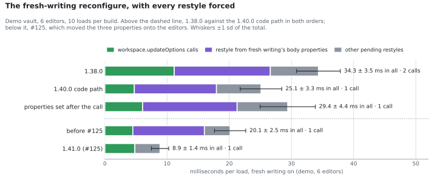
</picture>

The same build read 25.10 ± 3.34 ms in the first comparison and 20.14 ± 2.52 ms in the
second, seven minutes later. That is why each comparison is read only within itself.

**What this changes in the method.** A timer around one call measures everything the
browser does synchronously inside it, including a restyle that the code before it left
pending. Moving work from just after a call to just before it can then look like a
regression in the call. The rerun's per-call figures carry that risk, and so does every
"synchronous part" on this page; only this one has been rechecked with restyles forced
([T21](#threats-to-validity)).

## How to reproduce

**The numbers and charts on this page.** From the repository root:

```bash
python3 -m venv ~/.venvs/pulsar-perf
~/.venvs/pulsar-perf/bin/pip install pandas matplotlib jupyter nbconvert nbformat
~/.venvs/pulsar-perf/bin/jupyter nbconvert --to notebook --execute --inplace bench/performance.ipynb
```

That reads only [`bench/results/`](../bench/results), whose
[README](../bench/results/README.md) says what every column is and which build made it,
and rewrites the charts in `docs/assets/perf/`.

**The vitest benchmarks.** `npm run bench`, which prints mean ± sd per call through
`scripts/bench-table.mjs`.

**The live measurements.** [`bench/live/`](../bench/live) holds the harness as it ran,
with its paths turned into variables: the bench vault generator, the harness, the relay
into a named window, and the rerun driver. Its README says what each needs. The rules it
follows are the probe loop in [AGENTS.md](../AGENTS.md): check the vault's name first,
reveal a leaf before measuring anything a frame produces, change settings in memory
only and compare `data.json` afterwards, and return counts and timings, never note
titles. [`bench/extract.py`](../bench/extract.py) turns the raw run files into
`bench/results/`.
