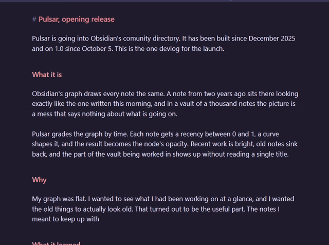
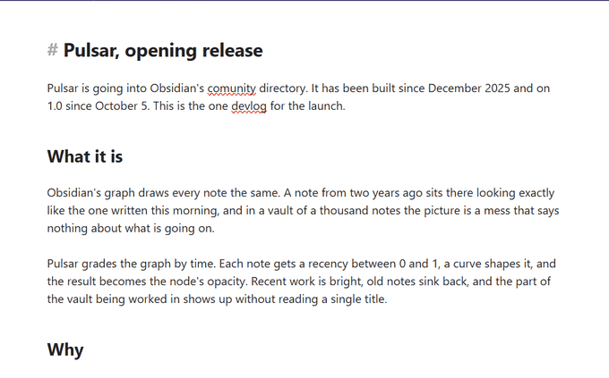

# Fresh writing

The one part of Pulsar that works inside a note rather than around it.

  

  

<i>The same thing on a light theme. Nothing about the colour is hard-coded — it cools toward whatever that text would otherwise be.</i>

**Light up what you just wrote.** Text takes a colour as you type it and cools
back to normal over the next few minutes, so a page you have been working in
shows you where the work actually was. Put the whole vault's idea inside a single
note: not *which* notes are warm, but *which paragraphs*.

**How it shows** is either of two opposite things. *Colour what is new* tints the
fresh writing and leaves the page alone. *Dim everything else* leaves the writing
alone and takes the rest of the page down toward the background — which never
replaces a colour you chose, so it suits actually working, where the tint suits a
screenshot. A note with nothing lit in it is never dimmed at all, so opening a
vault does not grey it.

**Pin this writing** holds a stretch at full strength and stops it cooling. A pin
is a marker rather than a timestamp — it answers *come back to this* — so it does
not fade, and it has its own colour. With nothing selected it pins the lit
stretch under the cursor, or the current line if there is none, which is what
makes it usable on text you did not just write. Pins clear when you reset or
when the note closes; nothing is written to the file, so there is nothing to
leave behind.

The status bar says how much of the note you are in is still lit — *· 340 lit ·
12 pinned* — and clicking it cools everything. It is only there while something
is lit.

**Start again** cools everything at once. That is the setting that makes it
usable rather than exhausting — once everything on the page counts as old, the
next thing you write stands on its own instead of competing with the last hour.
It is also a command, **Cool fresh writing**, so it can have a hotkey.

Three things worth knowing about how it works:

- **Nothing is written to the note.** It is a colour in the editor; the file on
  disk is byte for byte what it was. Close the note and the colour is gone.
- **It tracks characters, and it is cheap.** CodeMirror hands over the exact
  ranges each edit inserted and maps existing ranges through later edits itself,
  so the cost is in the size of the change rather than the size of the note. No
  diffing, no snapshots, no comparing anything to anything.
- **It reads where you wrote, never what you wrote.** Offsets and lengths. The
  text is never looked at, stored or counted.
- **It cools toward whatever that text would otherwise be.** The shades are mixed
  against `currentColor`, which on the `color` property means the inherited
  value — so a heading cools to its own colour rather than to body-text white and
  then snapping back when the mark expires. The dimming works the same way, so a
  dimmed heading is a dimmer version of itself instead of one flat grey.

Writing inside something already lit nests the new stretch inside the old one.
That is why the shades are colours rather than opacities — nested opacities
multiply into something far darker than either asked for, while nested colours
just let the innermost win, which is the newest edit, which is the right answer.

It applies in editing and Live Preview. Reading view isn't CodeMirror, so there
is nothing to colour there.

Off by default.

---

[← All docs](README.md) · [Pulsar](../README.md)
